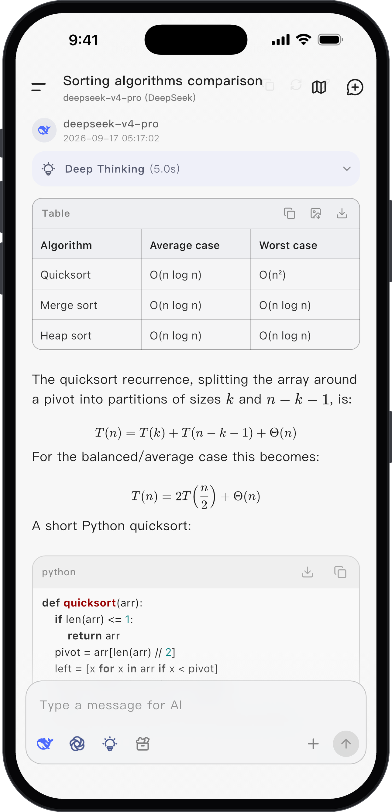
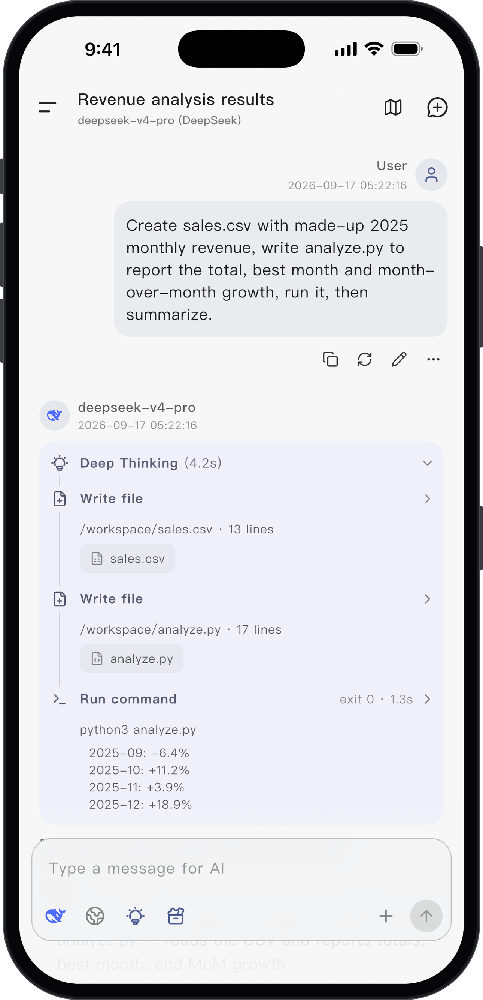
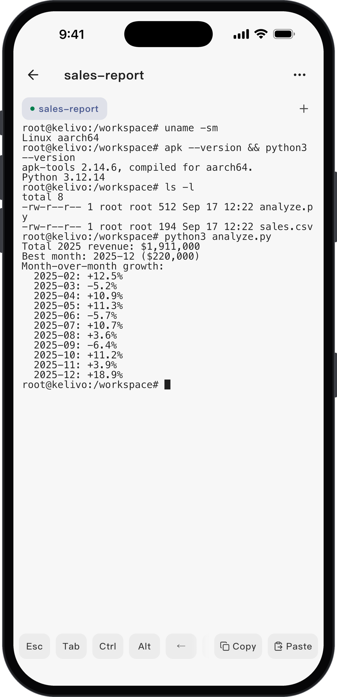
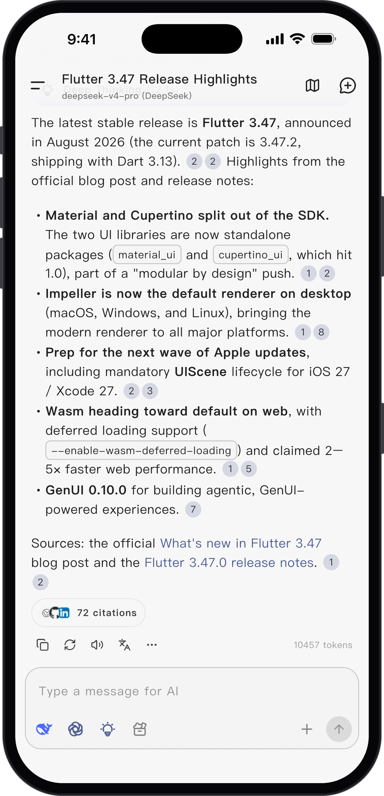

<div align="center">


# Kelivo

**开源的 LLM 客户端，覆盖手机与桌面。**

一个应用接入所有主流模型，给模型一个能真正做事的工作区，数据始终留在你自己的设备上。

<p>
  <a href="https://github.com/Chevey339/kelivo/releases/latest"></a>
  <a href="https://github.com/Chevey339/kelivo/releases"></a>
  <a href="https://github.com/Chevey339/kelivo/stargazers"></a>
  <a href="LICENSE"></a>
  <a href="https://flutter.dev"></a>
</p>

<p>
  <a href="https://discord.gg/Tb8DyvvV5T"></a>
  <a href="https://qm.qq.com/q/OQaXetKssC"></a>
</p>

<a href="https://trendshift.io/repositories/15452?utm_source=repository-badge&amp;utm_medium=badge&amp;utm_campaign=badge-repository-15452" target="_blank" rel="noopener noreferrer"></a>

[官网](https://kelivo.psycheas.top) · [使用手册](https://kelivo.psycheas.top/guide) · [下载](#-下载) · [反馈问题](https://github.com/Chevey339/kelivo/issues)

[English](README.md) · **简体中文**

</div>

## 💡 简介

Kelivo 是基于 Flutter 构建的跨平台 LLM 客户端，支持 Android、iOS、macOS、Windows 和 Linux。你可以填入自己的 API Key，也可以直接登录已支持的订阅账号，在同一个应用里使用 OpenAI、Gemini、Claude、DeepSeek、OpenRouter 以及任何 OpenAI 兼容服务。

Kelivo 不只是聊天。模型可以联网搜索、调用 MCP 服务器、按技能完成任务，并记住对你重要的信息。为对话绑定**工作区**后，模型还能读写文件、执行命令：在手机上运行于 Linux 沙盒中，在电脑上直接使用本机 Shell。

对话、设置和文件都保存在本地。Kelivo 没有自己的账号体系，需要时可以备份到 WebDAV 或 S3 兼容存储。

## 💖 赞助

<table>
<tr>
<td width="180" align="center" valign="middle">
  <b><a href="https://siliconflow.cn">siliconflow.cn</a></b>
</td>
<td valign="middle">感谢 siliconflow.cn 与我们合作提供可免费使用的模型。</td>
</tr>
<tr>
<td width="180" align="center" valign="middle">
  <a href="https://sui-xiang.com"></a><br />
  <b><a href="https://sui-xiang.com">随想AI中转</a></b>
</td>
<td valign="middle">感谢<a href="https://sui-xiang.com">随想AI中转</a>对本项目的赞助！随想AI中转 是一家可靠高效的 API 中继服务提供商，提供 Claude、Codex、Gemini 等的中继服务。注重隐私的中转站·无数据倒卖·无模型掺水，隐私，透明，极速售后。新账户注册每日签到就送 0.5 元测试额度，充值额度 1:1，无需订阅，按量付费。多线路冗余、跨区域容灾、自动故障切换，长链路 SSE 不中断。99.9% 可用性，关键调用从不掉队。</td>
</tr>
<tr>
<td width="180" align="center" valign="middle">
  <a href="https://api.muteki.site/register?aff=kelivo&promo=kelivo"></a>
</td>
<td valign="middle"><b><a href="https://api.muteki.site/register?aff=kelivo&promo=kelivo">MaruCode</a></b> 是一家偶尔做做慈善的小破站 API，自营号池，主要提供 Codex、Claude Code、GPT Image 等主流模型，支持 Websocket 协议，明码标价(Codex 0.25x, CC 1.5x)，透明汇率(1:1)，<a href="https://api.muteki.site/register?aff=kelivo&promo=kelivo">新用户注册送 2 刀</a>。<a href="https://images-2.muteki.site">生图工作台🖼️</a></td>
</tr>
</table>

如果 Kelivo 对你有帮助，也欢迎通过[微信赞赏](docx/sponsor.jpg)支持项目。

## 📸 截图

<p align="center">
  
  
  
  
</p>

## 🚀 下载

| 平台 | 获取方式 | 安装包 | 系统要求 |
| --- | --- | --- | --- |
| iOS / iPadOS | [App Store](https://apps.apple.com/us/app/kelivo/id6752122930) · [TestFlight](https://testflight.apple.com/join/erbGGykR)（测试版） | App Store；[Releases](https://github.com/Chevey339/kelivo/releases/latest) 另提供未签名 IPA | iOS 15.0 及以上 |
| Android | [GitHub Releases](https://github.com/Chevey339/kelivo/releases/latest) | APK（`arm64-v8a`、`armeabi-v7a`、`x86_64`） | Android 7.0 及以上 |
| macOS | [GitHub Releases](https://github.com/Chevey339/kelivo/releases/latest) | DMG | macOS 11.0 及以上，支持 Apple 芯片与 Intel |
| Windows | [GitHub Releases](https://github.com/Chevey339/kelivo/releases/latest) | 安装程序（`setup.exe`）或免安装 ZIP | Windows 10 / 11 |
| Linux | [GitHub Releases](https://github.com/Chevey339/kelivo/releases/latest) | AppImage、DEB、RPM、tar.gz | x86_64 |
| HarmonyOS | [kelivo-ohos](https://github.com/Chevey339/kelivo-ohos) | 在独立仓库中维护 | — |

官网的[下载页](https://kelivo.psycheas.top/downloads)提供同样的安装包。

## 🧭 快速上手

1. **添加模型供应商。** 打开 **设置 → 供应商**，为预置供应商填入 API Key 或添加自定义接口，然后拉取模型列表。如果使用 ChatGPT、Grok 或 Kimi Code 账号，也可以在 **添加供应商** 的 **账号登录** 页直接登录。
2. **开始对话。** 在输入栏选择模型；联网搜索、MCP 服务器、工具和思维链强度也在输入栏中按对话开启。
3. **让模型处理文件（可选）。** 打开 **设置 → 工作区与环境** 新建工作区，再在对话中绑定。Android 和 iOS 需要先在同一页面安装 Linux 环境；iOS 的环境随应用内置，无需下载。

[使用手册](https://kelivo.psycheas.top/guide)详细介绍了添加模型、记忆、世界书等功能的用法。

## ✨ 功能特性

### 🧠 模型与供应商

- **原生协议**：支持 OpenAI Chat Completions 与 Responses API、Google Gemini 与 Vertex AI、Anthropic Claude，并兼容任何 OpenAI 兼容接口，包括自部署的模型。
- **内置预设**：OpenAI、Gemini、Claude、DeepSeek、OpenRouter、硅基流动、阿里云千问、智谱、xAI、火山引擎等。
- **账号登录**：直接使用 ChatGPT（Codex）、Grok 或 Kimi Code 账号，自动同步可用模型并显示用量额度。
- **模型能力**：按模型设置输入输出模态、工具调用和推理能力；思维链强度可从关闭调到最高，也可以自定义 token 预算。
- **供应商内置工具**（视供应商支持情况）：原生联网搜索、URL 上下文、代码执行、代码解释器和图像生成。
- **多 Key 管理**：同一供应商可配置多个 API Key，支持轮询、优先级、最少使用和随机四种负载均衡策略，并自动标记异常的 Key。
- **请求控制**：在供应商、模型或助手级别自定义请求头和请求体；为每个供应商单独设置 HTTP、HTTPS 或 SOCKS5 代理；支持 Claude 提示词缓存、余额查询，以及按指数退避自动重试。
- **分组与分享**：为供应商分组，并通过二维码或文本分享、导入供应商配置。

### 🤖 智能体与工作区

- **工作区**：为对话绑定工作区后，模型可以使用 `shell`、`read_file`、`write_file`、`edit_file`、`list_dir`、`glob` 和 `grep` 七个工具。命令输出实时显示，文件修改以 diff 呈现；Shell 命令可以设为需要审批，按单条命令批准或在本次会话中全部允许。
- **手机上的 Linux 沙盒**：Android 通过 PRoot 运行 Ubuntu、Debian 或 Alpine Linux，也可以导入自己的 rootfs 镜像；iOS 内置基于 iSH 的 Alpine Linux，无需额外下载。可在应用内安装 Python、Node.js、Git、SSH 等常用工具，并通过测速为 apt/apk、pip 和 npm 选择最快的镜像源。
- **桌面端原生运行**：在 macOS、Windows 和 Linux 上，工具直接在系统 Shell 中运行，工作区可以是应用托管的文件夹，也可以链接电脑上的任意文件夹。
- **文件与终端**：内置文件浏览器，可预览 Markdown、HTML、CSV、图片和文本。手机端提供应用内终端，桌面端可在系统终端中打开工作区。手机端还可以把最多 10 个外部文件夹以只读或读写方式挂载到沙盒中。
- **环境变量**：所有工作区共享，并可防止变量值出现在命令输出中。
- **技能**：技能是包含 `SKILL.md` 的文件夹，可以通过粘贴 Markdown、导入 `.md` 或 `.zip` 文件、填写 GitHub 链接添加，并按助手或按对话启用。内置的 *skill-creator* 技能可以帮助模型编写新技能。
- **MCP**：通过 Streamable HTTP、SSE 或 STDIO 连接 Model Context Protocol 服务器，支持 OAuth 登录、JSON 导入和按工具审批，并内置 fetch 服务器。STDIO 服务器在桌面端原生运行，在手机端运行于 Linux 沙盒中。
- **向用户提问**：模型可以暂停下来，用选择题或开放式问题向你确认，再根据回答继续。
- **设备工具**：时间、剪贴板、计算器和文本转语音全平台可用；日历和定位支持 Android 与 iOS；屏幕使用时间支持 Android；天气、提醒事项和 Apple 健康数据支持 iOS。
- **定时任务**：按计划让指定助手执行提示词，例如每天早上的简报，结果保存为对话。支持 Android 和桌面端。

### 🧩 助手、记忆与上下文

- **助手**：每个助手都可以单独配置模型、支持模板变量的系统提示词、预设消息、采样参数、上下文消息数量、自定义请求、工具、MCP 服务器、技能、默认工作区、快捷短语、正则替换规则、头像和聊天背景，并可以用标签分类管理。
- **长期记忆**：开启自动整理后，每次对话结束时，后台流程会判断哪些信息值得记住，再提取、去重、合并为身份、工作流、语气、指令四类记忆。记忆可以是全局的，也可以只属于某个助手。所有记忆都可以浏览、编辑和归档；你还可以维护结构化的用户画像，并逐步查看每次后台整理的过程。注入的记忆保持稳定，不影响提示词缓存命中。
- **世界书**：由关键词或正则表达式触发的设定条目，可配置注入位置、角色和深度。
- **指令注入**：可复用的提示词卡片（例如内置的学习模式），在发送消息前应用。
- **对话工具**：压缩上下文并开启新对话、创建分支、保留多个回复版本、不留记录的临时对话、聊天建议，以及按对话单独设置模型和系统提示词。内置工具的描述也可以自行修改。

### 🔍 搜索、语音与视觉

- **联网搜索**：支持 24 种搜索服务，包括 Bing、DuckDuckGo、SearXNG、Brave、Exa、Tavily、Jina、Perplexity、Serper、Firecrawl、You.com、LinkUp、Parallel、Querit、TinyFish、AnySearch、Grok、Ollama、博查、秘塔、智谱、豆包、阶跃星辰和 Kelivo。多个 API Key 自动轮换，回答附带引用来源。
- **文本转语音**：系统 TTS，或 OpenAI、Gemini、Azure、ElevenLabs、MiniMax、通义千问、Groq、xAI、MiMo、阶跃星辰和 Fish Audio。
- **语音识别**：系统识别、离线本地模型，或 OpenAI Realtime、阿里云 DashScope、火山引擎、MiMo、阶跃星辰等云端服务。
- **多模态输入**：图片、PDF 和 Word 文档、文本与代码文件，以及模型支持时的音频；可以指定视觉模型进行 OCR，图片上传压缩质量可调。
- **图像生成**：支持图像输出模型和供应商的生图工具，输入栏提供绘图模式。
- **翻译**：直接翻译单条消息，或使用独立的翻译页面。

### 📝 阅读与管理

- **渲染**：Markdown、代码高亮、LaTeX 公式、表格、Mermaid 图表（可导出 PNG）和 HTML 预览。
- **导出**：将单条或选中的多条消息导出为 Markdown、纯文本或图片。
- **导航**：长对话迷你地图、全局搜索所有对话、置顶，以及在助手之间移动对话。
- **统计**：聊天热力图、token 用量（输入、输出和缓存），以及按模型和助手的使用排行。

### 🎨 外观

- 浅色与深色模式、Android 12+ 动态取色、内置调色板，以及可通过 JSON 分享的自定义主题。
- 聊天壁纸和渐变背景。消息气泡可选默认、毛玻璃或纯色样式，颜色、边框、圆角和模糊程度均可调整。
- 可使用系统字体、导入本地字体，或按需下载 Google Fonts，界面字体与代码字体分别设置。
- 界面支持简体中文、繁体中文和英文。

### 🔒 数据与隐私

- **本地存储**：对话、设置和附件都保存在你的设备上。
- **备份与恢复**：支持 WebDAV、S3 兼容存储和本地文件，恢复时可选择完全覆盖或合并。
- **本地副本**：自动在设备上保存数据快照，并额外保留上周和上个月各一份；每次恢复前也会先保存一份。
- **导入**：支持从 Cherry Studio 和 Chatbox 导入。
- **诊断**：请求日志、上下文日志（记录实际发送给模型的完整内容），以及存储空间占用明细。

### 🔗 系统集成

- **手机端**：生成可在后台持续进行，并在完成时通知；iOS 支持实时活动，Android 支持实时通知和任务悬浮窗。可以从其他应用分享文本和文件到 Kelivo，Android 上还能通过文本选择菜单直接发送选中的文字。
- **桌面端**：多栏布局、可自定义的快捷键（包括显示/隐藏 Kelivo 的全局快捷键）、系统托盘、拖拽添加附件，并在重新启动后恢复窗口大小与位置。

## 📊 平台差异

大部分功能在各平台上一致，以下能力取决于操作系统：

| 能力 | Android | iOS | macOS / Windows / Linux |
| --- | --- | --- | --- |
| 工作区运行环境 | Linux 沙盒（PRoot） | Linux 沙盒（iSH） | 本机 Shell |
| Linux 发行版 | Ubuntu、Debian、Alpine 或导入的 rootfs | Alpine（内置） | — |
| 终端 | 应用内终端 | 应用内终端 | 系统终端 |
| 访问外部文件夹 | 最多挂载 10 个文件夹 | 最多挂载 10 个文件夹 | 链接任意本地文件夹 |
| STDIO 类型的 MCP | 在沙盒中运行 | 在沙盒中运行 | 本机运行 |
| 定时任务 | ✓ | — | ✓ |
| 后台生成 | 常驻通知、实时通知、任务悬浮窗 | 增强后台运行、实时活动 | Kelivo 运行期间 |
| 平台专属设备工具 | 日历、定位、屏幕使用时间 | 日历、定位、天气、提醒事项、健康数据 | — |
| 全局快捷键与系统托盘 | — | — | ✓ |

桌面端的工作区命令以当前用户的权限运行，没有沙盒隔离。对于存放重要文件的工作区，建议保持命令审批开启。

## 🔧 从源码构建

**环境要求**

- Flutter 3.44.9 及以上（Dart 3.12）
- 目标平台的工具链：Android SDK、Xcode，或安装了“使用 C++ 的桌面开发”工作负载的 Visual Studio
- 仅 Linux（Debian/Ubuntu 包名）：`clang cmake ninja-build pkg-config libgtk-3-dev libgstreamer1.0-dev libgstreamer-plugins-base1.0-dev libkeybinder-3.0-dev libayatana-appindicator3-dev`
- 仅 iOS：`brew install meson ninja llvm lld`。Xcode 构建时会自动编译 iSH 沙盒并准备 Alpine Linux 镜像。
- 仅 Android：需要 `python3`、`curl` 和 `tar`。Gradle 构建时会自动下载 PRoot 二进制文件。

```bash
git clone https://github.com/Chevey339/kelivo.git
cd kelivo
flutter pub get
flutter run
```

部分依赖以源码形式放在 [`dependencies/`](dependencies) 目录并通过路径引用，无需额外配置。项目结构与代码规范见 [AGENTS.md](AGENTS.md)。

## 🤝 参与贡献

欢迎提交 Issue 和 Pull Request。提交 PR 前，请先在本地运行与 CI 相同的检查：

```bash
dart format lib test
dart analyze --fatal-infos lib test
flutter test
```

- **问题反馈与功能建议**：请使用 [Issue 模板](https://github.com/Chevey339/kelivo/issues/new/choose)。
- **界面改动**：遵循 [AGENTS.md](AGENTS.md) 中的 UI 规范，新页面需要分别提供手机端和桌面端布局。
- **本地化**：文案位于 [`lib/l10n`](lib/l10n)，以 `app_en.arb` 为模板。修改后运行 `flutter gen-l10n`，并一同提交生成的文件。
- **交流讨论**：欢迎加入 [Discord](https://discord.gg/Tb8DyvvV5T) 或 [QQ 群](https://qm.qq.com/q/OQaXetKssC)。

## 🙏 致谢

- [RikkaHub](https://github.com/re-ovo/rikkahub)：Kelivo 的界面设计深受其优美而实用的设计启发。
- [Minis](https://github.com/OpenMinis/OpenMinis)：iOS 端的 Linux 沙盒基于其 [iSH-ARM64](https://github.com/OpenMinis/ish-arm64) 移植构建，工作区的许多设计也参考了 Minis。
- [iSH](https://github.com/ish-app/ish)：iOS 沙盒所基于的上游 iOS Linux Shell 项目。
- [PRoot](https://github.com/termux/proot) 与 [Termux](https://termux.dev)：Android Linux 沙盒的基础。
- [sherpa-onnx](https://github.com/k2-fsa/sherpa-onnx)：提供离线语音识别。
- Kelivo 依赖的所有开源软件包，详见 [`pubspec.yaml`](pubspec.yaml)。

沙盒组件的完整第三方声明见 [`ios/sandbox/NOTICE`](ios/sandbox/NOTICE) 和 [`android/app/src/main/jniLibs/NOTICE`](android/app/src/main/jniLibs/NOTICE)。

## ⭐ Star History

[](https://star-history.com/#Chevey339/kelivo&Date)

## 📄 许可证

Kelivo 基于 [GNU Affero General Public License v3.0](LICENSE) 开源。
