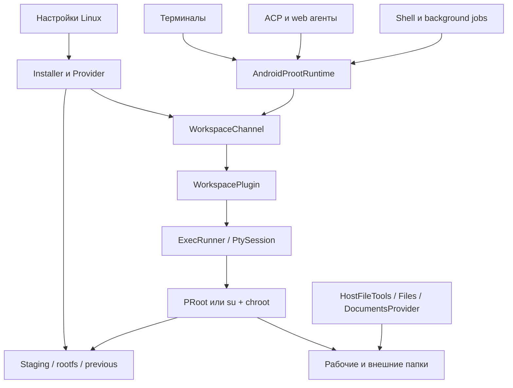

# Аудит Linux-окружения и ИИ-агентов Moru

Дата: 30 сентября 2026. Репозиторий: `mishaqp/Moru`, ветка `claude/moru-v0-1-16-audit-s69yji`, [PR #79](https://github.com/mishaqp/Moru/pull/79).
Снимок анализируемого кода: [`2c7e9da53ed88e68e0bfedccedaebca3bb5e5d0d`](https://github.com/mishaqp/Moru/tree/2c7e9da53ed88e68e0bfedccedaebca3bb5e5d0d).
Изменяется исключительно этот документ. Код, настройки сборки и версия приложения не изменяются.

**Статус: аудит исходников завершён.** 48 записей A-01…A-48: A-05 — подтверждённая живая раскладка, а не дефект; остальные — функциональные, security, UX и coverage findings с условиями. Выполненные probes, просмотренный CI, проверки владельца и непроверенные phone-гипотезы разделены. Документ сохранялся отдельными коммитами; приложение не изменялось.
[AGENTS.md:1-160](https://github.com/mishaqp/Moru/blob/2c7e9da53ed88e68e0bfedccedaebca3bb5e5d0d/AGENTS.md#L1-L160) и [docs/releases/v0.1.47.md:231-241](https://github.com/mishaqp/Moru/blob/2c7e9da53ed88e68e0bfedccedaebca3bb5e5d0d/docs/releases/v0.1.47.md#L231-L241) прочитаны; учитываются уже выполненные исправления v0.1.47. Лента чата, темы и обычные провайдеры моделей вне области аудита. Настройки провайдера рассматриваются только как входные данные ACP.

Метки доказательств: **Код** — вывод из прочитанных исходников; **Запуск** — выполненная в этой сессии проверка; **CI** — просмотренные логи точного SHA; **Сообщено владельцем** — уже выполненная проверка из задания; **Гипотеза** — требует воспроизведения. Телефон и Android WebView здесь недоступны. S/M/L — относительный объём работы, не обещание сроков.

## 1. Краткое резюме — 10 главных проблем

1. **A-29/A-30/A-31:** разные Dart-пути следуют симлинкам за пределы рабочей папки: чтение чужих app-owned данных, автоматические AGENTS instructions, удаление чужих файлов через Files.
2. **A-48:** OpenCode web по умолчанию запускается без пароля; loopback не заменяет аутентификацию командного API.
3. **A-02:** переключение root не останавливает живые потребители runtime и гоняется с возвратом владельцев.
4. **A-12/A-19:** service-owned данные остаются недоступными PRoot; root-owned rootfs мешает Reset и очистке после замены.
5. **A-13/A-14:** chroot меняет host /dev, а writable alias /downloads обходит readonly той же папки.
6. **A-15/A-18:** env-sanitized root-потомки могут пережить Stop; блокирующая PTY-вставка идёт на Android main thread.
7. **A-01/A-21:** ACP сохраняет устаревшие настройки, а startup/session requests могут зависнуть вне управления Stop.
8. **A-20/A-24:** текущему Codex выдаётся неподдержанный Chat Completions config; DSH не получает custom gateway headers.
9. **A-06/A-07/A-08/A-09/A-43/A-44:** отмена, dpkg lock, предложение обновления и crash recovery имеют конкретные разрывы: от ненужной переустановки до partial rootfs со статусом ready.
10. **A-03/A-04/A-11/A-35…A-40:** UI неверно объясняет готовность/результат, скрывает outcome и смешивает daily и destructive actions; это делает технические ошибки непонятными новичку.

**A-05 не функциональный дефект:** wide layouts живые и нужны Android ≥1200 logical pixels. **H-01…H-04 — гипотезы/границы проверки**, а не наблюдённые phone failures. A-27/A-32/A-45 также имеют явно указанное условие триггера; actual built-in secret leak/PlatformException/ENOSPC здесь не наблюдались.

## 2. Карта системы

В Moru **одна rootfs** и несколько независимых потребителей. Скачивание образа/подготовка — отдельные операции; команды, терминалы и агенты используют готовую систему. Files/file-tools часто выполняют host I/O напрямую, поэтому безопасность Linux launch не защищает автоматически эти Dart-пути.



| Компонент | Данные и ответственность | Связь с остальными |
|---|---|---|
| EnvironmentProvider | State, image/source, variables, mirror choices, PRoot args, root flag, disk metrics. SQLite-backed preferences. | Installer пишет состояния; runtime читает effective execution config. [lib/core/providers/environment_provider.dart:79-162](https://github.com/mishaqp/Moru/blob/2c7e9da53ed88e68e0bfedccedaebca3bb5e5d0d/lib/core/providers/environment_provider.dart#L79-L162) |
| RootfsCatalog / RootfsSource / MirrorService | Закреплённые distro/arm64 URL+SHA, archive source; отдельно mirrors apt/apk/pip/npm. | Не путать зеркало **образа** и зеркало **пакетов**; saved manual preferences сохраняются. [lib/core/services/sandbox/rootfs_catalog.dart:37-43](https://github.com/mishaqp/Moru/blob/2c7e9da53ed88e68e0bfedccedaebca3bb5e5d0d/lib/core/services/sandbox/rootfs_catalog.dart#L37-L43), [lib/core/services/sandbox/mirror_service.dart:335-389](https://github.com/mishaqp/Moru/blob/2c7e9da53ed88e68e0bfedccedaebca3bb5e5d0d/lib/core/services/sandbox/mirror_service.dart#L335-L389) |
| EnvironmentInstaller | Download/resume/hash → staging extract → inspect ABI → patch → current/previous swap; repair/reset/update/root switch. | Native extract/patch через channel; Dart HTTP/files/DB отдельно. Current/previous recovery не равен общему crash journal. [lib/core/services/sandbox/environment_installer.dart:397-492](https://github.com/mishaqp/Moru/blob/2c7e9da53ed88e68e0bfedccedaebca3bb5e5d0d/lib/core/services/sandbox/environment_installer.dart#L397-L492) |
| AndroidProotRuntime / WorkspaceChannel | Readiness, env, cwd, Mount snapshots, run/stdio/PTY/cancel methods/events. | Common launch transport; consumer ownership/cancellation различается. [lib/core/services/sandbox/android_proot_runtime.dart:92-175](https://github.com/mishaqp/Moru/blob/2c7e9da53ed88e68e0bfedccedaebca3bb5e5d0d/lib/core/services/sandbox/android_proot_runtime.dart#L92-L175) |
| WorkspacePlugin / ExecRunner / PtySession | Native process creation, pipes, events, terminal fds, busy/mount guard. | Root toggle не вызывает existing busy/stop barrier (A-02). [android/app/src/main/kotlin/com/psyche/kelivo/workspace/WorkspacePlugin.kt:61-118](https://github.com/mishaqp/Moru/blob/2c7e9da53ed88e68e0bfedccedaebca3bb5e5d0d/android/app/src/main/kotlin/com/psyche/kelivo/workspace/WorkspacePlugin.kt#L61-L118) |
| ProotCommand / ChrootCommand / moru_chroot.c | PRoot fake root/binds/IPC/profile либо su+namespace/chroot/binds/owner cleanup. | Shared rootfs, разные actual kernel permissions; private mount namespace не отменяет inode changes. [android/app/src/main/kotlin/com/psyche/kelivo/workspace/ProotCommand.kt:108-120](https://github.com/mishaqp/Moru/blob/2c7e9da53ed88e68e0bfedccedaebca3bb5e5d0d/android/app/src/main/kotlin/com/psyche/kelivo/workspace/ProotCommand.kt#L108-L120), [android/app/src/main/kotlin/com/psyche/kelivo/workspace/ChrootCommand.kt:65-83](https://github.com/mishaqp/Moru/blob/2c7e9da53ed88e68e0bfedccedaebca3bb5e5d0d/android/app/src/main/kotlin/com/psyche/kelivo/workspace/ChrootCommand.kt#L65-L83) |
| TerminalSessionManager | In-memory sessions и emulator/output, target/mount reuse, resize/key input/wakelock. | Page/mini window attach той же live session; Android process kill не даёт persisted PTY reconnect. [lib/features/workspace/terminal/terminal_session_manager.dart:245-311](https://github.com/mishaqp/Moru/blob/2c7e9da53ed88e68e0bfedccedaebca3bb5e5d0d/lib/features/workspace/terminal/terminal_session_manager.dart#L245-L311) |
| EnvironmentDependencies | Distro-aware package script, probes+versions, serial/batch install/cancel, bounded log. | Через runtime; terminal/ACP могут отдельно вызывать apt и конфликтовать locks. [lib/core/services/sandbox/environment_dependencies.dart:175-213](https://github.com/mishaqp/Moru/blob/2c7e9da53ed88e68e0bfedccedaebca3bb5e5d0d/lib/core/services/sandbox/environment_dependencies.dart#L175-L213) |
| AcpAgentManager / catalogue | Npm prep, Node upgrade, install/update/uninstall/check, provider/env/config mapping. | STDIO transport → AcpAgent/Connection; пользовательская программа/agent version не означает model success. [lib/core/services/acp/acp_agent_manager.dart:280-434](https://github.com/mishaqp/Moru/blob/2c7e9da53ed88e68e0bfedccedaebca3bb5e5d0d/lib/core/services/acp/acp_agent_manager.dart#L280-L434) |
| AcpChatSessions / Bridge / MCP | Один live process/session на chat, restore/history, permission/tool translation; Moru-only authenticated tools endpoint. | Agent имеет собственные Linux tools; Moru MCP добавляет browser/mini-apps/memory/scheduled. [lib/core/services/acp/acp_chat_sessions.dart:165-228](https://github.com/mishaqp/Moru/blob/2c7e9da53ed88e68e0bfedccedaebca3bb5e5d0d/lib/core/services/acp/acp_chat_sessions.dart#L165-L228), [lib/features/home/services/acp_chat_bridge.dart:59-82](https://github.com/mishaqp/Moru/blob/2c7e9da53ed88e68e0bfedccedaebca3bb5e5d0d/lib/features/home/services/acp_chat_bridge.dart#L59-L82) |
| AcpAgentWebServers / shared WebView | Independent web process per agent, provider/mount matching, loopback URL and token, browser tab. | Assistant default workspace; собственная auth upstream, отдельно от MCP bearer. [lib/features/agents/agent_web_start.dart:18-38](https://github.com/mishaqp/Moru/blob/2c7e9da53ed88e68e0bfedccedaebca3bb5e5d0d/lib/features/agents/agent_web_start.dart#L18-L38), [lib/core/services/acp/acp_agent_web_servers.dart:279-293](https://github.com/mishaqp/Moru/blob/2c7e9da53ed88e68e0bfedccedaebca3bb5e5d0d/lib/core/services/acp/acp_agent_web_servers.dart#L279-L293) |
| WorkspaceProvider / WorkspacePaths / Files / DocumentsProvider | Binding chat→folder, host↔guest paths, linked phone mounts, direct host reads/mutations and Android document export. | Realpath policy нужна каждому host-I/O consumer; Dart Files и native DocumentsProvider имеют разные guards. [lib/core/services/workspace/workspace_paths.dart:138-179](https://github.com/mishaqp/Moru/blob/2c7e9da53ed88e68e0bfedccedaebca3bb5e5d0d/lib/core/services/workspace/workspace_paths.dart#L138-L179), [android/app/src/main/kotlin/com/psyche/kelivo/workspace/WorkspaceDocumentPaths.kt:37-46](https://github.com/mishaqp/Moru/blob/2c7e9da53ed88e68e0bfedccedaebca3bb5e5d0d/android/app/src/main/kotlin/com/psyche/kelivo/workspace/WorkspaceDocumentPaths.kt#L37-L46) |
| ToolRunRegistry / TaskPlanRegistry | Running background job UUID/output/stop и latest plan checklist. | Process живёт через runtime независимо от reply; registry identity должна быть durable и уникальной. [lib/core/services/workspace/tool_run_registry.dart:149-220](https://github.com/mishaqp/Moru/blob/2c7e9da53ed88e68e0bfedccedaebca3bb5e5d0d/lib/core/services/workspace/tool_run_registry.dart#L149-L220) |

Практический путь «Установить агент»: prerequisites/packages → compatible Node → npm → refresh executable → provider config/env → start STDIO → ACP initialize → session/new/load/resume → prompt → model/tool work. Веб-вариант после конфигурации запускает long-lived server и ждёт authenticated URL. Терминал запускает PTY, а Files **не** проходит через STDIO/PTY. Это объясняет, почему успешная установка/initialize не доказывает ни ответ модели, ни правильность файловых границ.

## 3. Находки

| ID | Область | Серьёзность | Описание и доказательство | Файл:строка | Сценарий: шаги → ожидалось → на самом деле | Предлагаемое исправление | Объём |
|---|---|---|---|---|---|---|---|
| A-01 | ACP / настройки запуска | Высокая | **Код; ранее подтверждено владельцем.** `_launchKey` не содержит `anthropicProvider`, `responsesApi`, `headers`, `mount.readOnly` и переменных окружения. Веб-сравнение учитывает параметры провайдера и полные `Mount`, но пользовательские переменные также не являются его входом. | [lib/core/services/acp/acp_chat_sessions.dart:165-177](https://github.com/mishaqp/Moru/blob/2c7e9da53ed88e68e0bfedccedaebca3bb5e5d0d/lib/core/services/acp/acp_chat_sessions.dart#L165-L177); [lib/core/services/acp/acp_chat_sessions.dart:254-266](https://github.com/mishaqp/Moru/blob/2c7e9da53ed88e68e0bfedccedaebca3bb5e5d0d/lib/core/services/acp/acp_chat_sessions.dart#L254-L266); [lib/core/services/acp/acp_agent_web_servers.dart:279-293](https://github.com/mishaqp/Moru/blob/2c7e9da53ed88e68e0bfedccedaebca3bb5e5d0d/lib/core/services/acp/acp_agent_web_servers.dart#L279-L293); [lib/core/services/acp/acp_agent_manager.dart:550-555](https://github.com/mishaqp/Moru/blob/2c7e9da53ed88e68e0bfedccedaebca3bb5e5d0d/lib/core/services/acp/acp_agent_manager.dart#L550-L555) | Запустить агент в чате → поменять формат API / требуемый заголовок / переменную / writable-папку на readonly → отправить следующую задачу. Ожидалось: новый процесс с актуальными настройками и правами. Фактически: совпадает старый ключ, используется прежний процесс; новые значения не попадают в уже запущенное окружение. | Общий неизменяемый снимок эффективного запуска для ACP и веба: API, headers, переменные, mounts с правами и поколение runtime; сравнивать без вывода секретов. | M |
| A-02 | Root / жизненный цикл процессов | Высокая | **Код; ранее подтверждено владельцем.** Переключение сохраняет флаг, но не завершает терминалы, ACP, веб, мини-серверы и фоновые команды. При выключении флаг меняется до `chrootFixOwner`; продолжающие работу root-процессы могут снова создавать чужие файлы. | [lib/core/services/sandbox/environment_installer.dart:699-712](https://github.com/mishaqp/Moru/blob/2c7e9da53ed88e68e0bfedccedaebca3bb5e5d0d/lib/core/services/sandbox/environment_installer.dart#L699-L712); [lib/features/workspace/widgets/environment/environment_pane.dart:346-359](https://github.com/mishaqp/Moru/blob/2c7e9da53ed88e68e0bfedccedaebca3bb5e5d0d/lib/features/workspace/widgets/environment/environment_pane.dart#L346-L359); [lib/core/services/acp/acp_chat_sessions.dart:254-266](https://github.com/mishaqp/Moru/blob/2c7e9da53ed88e68e0bfedccedaebca3bb5e5d0d/lib/core/services/acp/acp_chat_sessions.dart#L254-L266) | Запустить терминал/агента в root → выключить «Быстрый режим» → продолжить команду в прежней сессии. Ожидалось: все последующие операции через PRoot, файлы доступны Moru. Фактически: живой процесс сохраняет root и старые монтирования; возврат владельцев не препятствует новым root-записям. | Общий барьер переключения: запретить новые запуски, остановить и дождаться всех потребителей runtime, вернуть владельцев, затем завершить смену режима и перепроверить систему. | L |
| A-03 | Проверка агента / UX-честность | Средняя | **Код; ранее подтверждено владельцем.** `check` делает loopback-probe и `start/initialize`, затем возвращает `agent.info`, не создавая модельный запрос. Русский статус звучит как проверка способности отвечать. | [lib/core/services/acp/acp_agent_manager.dart:389-419](https://github.com/mishaqp/Moru/blob/2c7e9da53ed88e68e0bfedccedaebca3bb5e5d0d/lib/core/services/acp/acp_agent_manager.dart#L389-L419); [lib/core/services/acp/acp_agent.dart:188-210](https://github.com/mishaqp/Moru/blob/2c7e9da53ed88e68e0bfedccedaebca3bb5e5d0d/lib/core/services/acp/acp_agent.dart#L188-L210); [lib/l10n/app_ru.arb:1148](https://github.com/mishaqp/Moru/blob/2c7e9da53ed88e68e0bfedccedaebca3bb5e5d0d/lib/l10n/app_ru.arb#L1148) | Установить агент, задать неверный ключ или несовместимый формат API → «Проверить связь». Ожидалось: проверка подключения к модели. Фактически: если агент откладывает авторизацию до запроса, ACP-приветствие успешно и экран пишет «Работает». | Разделить статусы «Программа запускается», «Инструменты Moru доступны», «Модель ответила»; настоящий короткий запрос к модели запускать отдельной понятной проверкой. | M |
| A-04 | Экран «Окружение» | UX | **Код; ранее подтверждено владельцем.** Одна лента объединяет состояние, файлы, пакеты, зеркала, переменные, обслуживание, выбор образа, PRoot и root. | [lib/features/workspace/widgets/environment/environment_pane.dart:424-611](https://github.com/mishaqp/Moru/blob/2c7e9da53ed88e68e0bfedccedaebca3bb5e5d0d/lib/features/workspace/widgets/environment/environment_pane.dart#L424-L611); [lib/features/workspace/widgets/environment/environment_pane.dart:614-646](https://github.com/mishaqp/Moru/blob/2c7e9da53ed88e68e0bfedccedaebca3bb5e5d0d/lib/features/workspace/widgets/environment/environment_pane.dart#L614-L646) | Новичок открывает настройки, чтобы запустить агента → ожидает последовательность «подготовить → выбрать → начать». Фактически: должен сам понять несколько разнородных блоков и различие установки системы, пакетов, ремонта и сброса. | Главный экран «Linux»: состояние + терминал/файлы/агенты; подготовка одной задачей; пакеты отдельным экраном; зеркала/переменные/PRoot в «Дополнительно»; замена/сброс в «Обслуживание». | L |
| A-05 | Android wide layout / названия | Низкая | **Код; reachability проверена.** `*_desktop_layout.dart` реально импортируются и выбираются через `useDesktopWorkspaceLayout` → `ResponsiveHelper.isDesktop`. Их нельзя удалять только из-за имени. | [lib/features/workspace/workspace_layout.dart:5-7](https://github.com/mishaqp/Moru/blob/2c7e9da53ed88e68e0bfedccedaebca3bb5e5d0d/lib/features/workspace/workspace_layout.dart#L5-L7); [lib/features/workspace/pages/environment_page.dart:19-23](https://github.com/mishaqp/Moru/blob/2c7e9da53ed88e68e0bfedccedaebca3bb5e5d0d/lib/features/workspace/pages/environment_page.dart#L19-L23); [lib/features/workspace/pages/workspace_files_page.dart:36-47](https://github.com/mishaqp/Moru/blob/2c7e9da53ed88e68e0bfedccedaebca3bb5e5d0d/lib/features/workspace/pages/workspace_files_page.dart#L36-L47) | Открыть раздел на широком Android-планшете/складном экране → ожидается адаптивная раскладка. Фактически: предусмотрен переход в desktop-названные виджеты; все четыре пути достижимы при ширине Android-окна ≥1200 логических пикселей. Это не функциональный дефект, только вводящее в заблуждение имя. | Сохранить эти раскладки. Переименование desktop → wide необязательно; удаления по имени не делать. | S |

| A-06 | Установка / «Исправить» | Средняя | **Код.** Cancel прерывает HTTP, но не native extract/patch. После распаковки отмена проверяется; во время repair не проверяется вообще. | [lib/core/services/sandbox/environment_installer.dart:168-204](https://github.com/mishaqp/Moru/blob/2c7e9da53ed88e68e0bfedccedaebca3bb5e5d0d/lib/core/services/sandbox/environment_installer.dart#L168-L204); [lib/core/services/sandbox/environment_installer.dart:419-456](https://github.com/mishaqp/Moru/blob/2c7e9da53ed88e68e0bfedccedaebca3bb5e5d0d/lib/core/services/sandbox/environment_installer.dart#L419-L456); [android/app/src/main/kotlin/com/psyche/kelivo/workspace/WorkspacePlugin.kt:347-355](https://github.com/mishaqp/Moru/blob/2c7e9da53ed88e68e0bfedccedaebca3bb5e5d0d/android/app/src/main/kotlin/com/psyche/kelivo/workspace/WorkspacePlugin.kt#L347-L355) | Начать установку → дождаться «Распаковка» → Отмена. Ожидалось: операция прекращается и освобождает экран. Фактически: native-запись продолжается до завершения, затем удаляется staging. Во время «Исправить» → Отмена: repair всё равно объявляет ready. | Идентификатор native-операции; cancel-and-await для hash/extract/patch; отдельный статус «Отменяем…»; один протокол отмены для установки и ремонта. | M |
| A-07 | Пакеты / блокировка dpkg | Средняя | **Код + безопасный запуск.** Перед apt с Lock::Timeout=60 выполняется голый `dpkg --configure -a`; при чужой блокировке `set -e` прерывает сценарий немедленно. | [lib/core/services/sandbox/environment_dependencies.dart:185-190](https://github.com/mishaqp/Moru/blob/2c7e9da53ed88e68e0bfedccedaebca3bb5e5d0d/lib/core/services/sandbox/environment_dependencies.dart#L185-L190) | На Debian/Ubuntu начать apt в терминале → пока он держит lock, установить пакет в UI. Ожидалось: ограниченное ожидание очереди. Фактически: ранний dpkg завершается до apt; установка проваливается. Fixture: exit 2 за 0.021 с, apt не вызван. | Общий шлюз UI-транзакций + ограниченное ожидание для configure; корректная отмена. Не удалять lock-файлы. Проверять реальную конкуренцию dpkg. | M |
| A-08 | Пакеты / ранняя отмена | Средняя | **Код; временное окно на телефоне требует воспроизведения.** `_run` выдаёт runId, но не передаёт `isCancelled`; runtime ещё ожидает readiness. Cancel может попасть в незарегистрированный ID, после чего exec всё равно запускается. | [lib/core/services/sandbox/environment_dependencies.dart:302-307](https://github.com/mishaqp/Moru/blob/2c7e9da53ed88e68e0bfedccedaebca3bb5e5d0d/lib/core/services/sandbox/environment_dependencies.dart#L302-L307); [lib/core/services/sandbox/environment_dependencies.dart:345-356](https://github.com/mishaqp/Moru/blob/2c7e9da53ed88e68e0bfedccedaebca3bb5e5d0d/lib/core/services/sandbox/environment_dependencies.dart#L345-L356); [lib/core/services/sandbox/android_proot_runtime.dart:93-99](https://github.com/mishaqp/Moru/blob/2c7e9da53ed88e68e0bfedccedaebca3bb5e5d0d/lib/core/services/sandbox/android_proot_runtime.dart#L93-L99); [lib/core/services/sandbox/channel_command_run.dart:100-108](https://github.com/mishaqp/Moru/blob/2c7e9da53ed88e68e0bfedccedaebca3bb5e5d0d/lib/core/services/sandbox/channel_command_run.dart#L100-L108) | Установить пакет → немедленно Отмена, пока идёт native probe. Ожидалось: процесс не запускается либо сразу прекращается. Фактически: ранний native cancel не находит ID; отсутствующий callback позволяет последующий запуск. Для детерминированной проверки задержать fake probe. | Передавать `isCancelled: () => _cancelled` и использовать уже реализованный двойной guard channel-runtime; тест до и после native-регистрации. | S |
| A-09 | Обновление образа | Средняя | **Код.** Check предлагает Ubuntu 24.04.4, но следующий переход в установку подставляет сохранённый 24.04.3. Это замена rootfs с отдельным подтверждением, а не apt upgrade. | [lib/core/services/sandbox/environment_installer.dart:235-249](https://github.com/mishaqp/Moru/blob/2c7e9da53ed88e68e0bfedccedaebca3bb5e5d0d/lib/core/services/sandbox/environment_installer.dart#L235-L249); [lib/features/workspace/widgets/environment/environment_pane.dart:234-252](https://github.com/mishaqp/Moru/blob/2c7e9da53ed88e68e0bfedccedaebca3bb5e5d0d/lib/features/workspace/widgets/environment/environment_pane.dart#L234-L252); [lib/features/workspace/widgets/environment/environment_pane.dart:316-325](https://github.com/mishaqp/Moru/blob/2c7e9da53ed88e68e0bfedccedaebca3bb5e5d0d/lib/features/workspace/widgets/environment/environment_pane.dart#L316-L325); [lib/features/workspace/pages/environment_download_page.dart:58-84](https://github.com/mishaqp/Moru/blob/2c7e9da53ed88e68e0bfedccedaebca3bb5e5d0d/lib/features/workspace/pages/environment_download_page.dart#L58-L84) | Установить default 24.04.3 → Проверить обновления → повторно нажать строку с 24.04.4 → принять выбор без ручного изменения → подтвердить замену. Ожидалось: предложенный новый образ. Фактически: переустанавливается 24.04.3, гостевые пакеты заменяются; следующий check снова предлагает 24.04.4. | Передать предложенный image в update-навигацию; не менять сохранённый выбор при read-only check; назвать операцию «Заменить системой версии …» и показать последствия. | S |
| A-10 | Зеркала / замена rootfs | Низкая | **Код.** Выбор зеркала хранится отдельно; после замены/сброса и установки UI считает его активным, хотя новая rootfs получила собственные config-файлы. Обычная установка пакетов правильно переигрывает сохранённый выбор. | [lib/core/services/sandbox/environment_installer.dart:446-488](https://github.com/mishaqp/Moru/blob/2c7e9da53ed88e68e0bfedccedaebca3bb5e5d0d/lib/core/services/sandbox/environment_installer.dart#L446-L488); [lib/core/providers/environment_provider.dart:331-341](https://github.com/mishaqp/Moru/blob/2c7e9da53ed88e68e0bfedccedaebca3bb5e5d0d/lib/core/providers/environment_provider.dart#L331-L341); [lib/features/workspace/widgets/environment/environment_pane.dart:1038-1041](https://github.com/mishaqp/Moru/blob/2c7e9da53ed88e68e0bfedccedaebca3bb5e5d0d/lib/features/workspace/widgets/environment/environment_pane.dart#L1038-L1041); [lib/core/services/sandbox/environment_dependencies.dart:246-268](https://github.com/mishaqp/Moru/blob/2c7e9da53ed88e68e0bfedccedaebca3bb5e5d0d/lib/core/services/sandbox/environment_dependencies.dart#L246-L268) | Выбрать зеркало apt/apk → заменить rootfs → до установки пакетов сравнить UI с `/etc/apt/…` или `/etc/apk/repositories`. Ожидалось: выбранное активное зеркало применено. Фактически: preference прежний, гостевой config из нового архива; явный apply/установка пакетов затем исправляет. | При подготовке новой rootfs применить совместимые сохранённые зеркала либо честно показать «сохранено, ещё не применено». Проверять preference и реальные файлы вместе. | M |
| A-11 | Пакеты / готовность к агентам | UX | **Код.** Prepare считает только missing; unknown не мешает выводу «Всё нужное агентам установлено» и отключению кнопки. | [lib/features/workspace/widgets/environment/environment_dependencies_section.dart:135-136](https://github.com/mishaqp/Moru/blob/2c7e9da53ed88e68e0bfedccedaebca3bb5e5d0d/lib/features/workspace/widgets/environment/environment_dependencies_section.dart#L135-L136); [lib/features/workspace/widgets/environment/environment_dependencies_section.dart:203-233](https://github.com/mishaqp/Moru/blob/2c7e9da53ed88e68e0bfedccedaebca3bb5e5d0d/lib/features/workspace/widgets/environment/environment_dependencies_section.dart#L203-L233); [lib/l10n/app_ru.arb:5283](https://github.com/mishaqp/Moru/blob/2c7e9da53ed88e68e0bfedccedaebca3bb5e5d0d/lib/l10n/app_ru.arb#L5283) | Первое открытие пакетов во время probe либо после его ошибки. Ожидалось: «Проверяем / не проверено / повторить». Фактически: строки ещё unknown, но блок подготовки объявляет всё установленным. | Считать готовностью только installed для всех необходимых пакетов; unknown и failed — отдельные состояния с повторной проверкой. | S |

| A-12 | Root → PRoot / владельцы | Высокая | **Код + изолированный C-стенд.** `fix_entry` пропускает uid≠0 И gid≠0; `postgres:postgres` и другие service accounts не возвращаются UID приложения. `_apt:root` не пропускается, поскольку gid=0. | [android/app/src/main/cpp/moru_chroot.c:195-222](https://github.com/mishaqp/Moru/blob/2c7e9da53ed88e68e0bfedccedaebca3bb5e5d0d/android/app/src/main/cpp/moru_chroot.c#L195-L222) | В root создать postgres-owned каталог 0700 и файл 0600 либо установить/инициализировать PostgreSQL → выключить root → открыть через PRoot/Files. Ожидалось: данные доступны после смены режима. Фактически: kernel DAC сохраняет чужие uid/gid; fake root PRoot не даёт права чтения. Стенд: 100:101 → 0 вызовов lchown. | Отдельная политика app-owned binds и guest rootfs: перевод foreign owners без разрушения service-user semantics при следующем root-запуске; тест 0700/0600 и обратного переключения. | M |
| A-13 | Chroot / Android /dev | Высокая | **Код + безопасный стенд.** После bind настоящего `/dev` standard_devices создаёт symlink и mkdir через него. Private mount namespace изолирует mounts, но не записи в общий inode. | [android/app/src/main/cpp/moru_chroot.c:240-287](https://github.com/mishaqp/Moru/blob/2c7e9da53ed88e68e0bfedccedaebca3bb5e5d0d/android/app/src/main/cpp/moru_chroot.c#L240-L287); [docs/releases/v0.1.47.md:237](https://github.com/mishaqp/Moru/blob/2c7e9da53ed88e68e0bfedccedaebca3bb5e5d0d/docs/releases/v0.1.47.md#L237) | Первый root-запуск на телефоне без `/dev/fd`, std* или shm → ожидается отсутствие изменений Android после выхода. Фактически: недостающие directory entries создаются в host `/dev` и остаются до очистки/перезагрузки; SELinux может вместо этого отказать (это phone-гипотеза). | Private tmpfs/overlay для guest /dev, нужные nodes/devpts через точечные binds; проверять host entries до/после, а не только mountinfo. | M |
| A-14 | Внешняя папка / read-only | Высокая | **Код.** Downloads всегда добавлен writable как `/downloads`; тот же host может быть readonly `/mounts/Downloads`. Readonly одного alias не защищает другой. | [lib/core/services/workspace/workspace_paths.dart:40-46](https://github.com/mishaqp/Moru/blob/2c7e9da53ed88e68e0bfedccedaebca3bb5e5d0d/lib/core/services/workspace/workspace_paths.dart#L40-L46); [lib/core/services/workspace/workspace_paths.dart:80-91](https://github.com/mishaqp/Moru/blob/2c7e9da53ed88e68e0bfedccedaebca3bb5e5d0d/lib/core/services/workspace/workspace_paths.dart#L80-L91); [android/app/src/main/kotlin/com/psyche/kelivo/workspace/WorkspacePlugin.kt:411-414](https://github.com/mishaqp/Moru/blob/2c7e9da53ed88e68e0bfedccedaebca3bb5e5d0d/android/app/src/main/kotlin/com/psyche/kelivo/workspace/WorkspacePlugin.kt#L411-L414); [android/app/src/main/kotlin/com/psyche/kelivo/workspace/ChrootCommand.kt:72-77](https://github.com/mishaqp/Moru/blob/2c7e9da53ed88e68e0bfedccedaebca3bb5e5d0d/android/app/src/main/kotlin/com/psyche/kelivo/workspace/ChrootCommand.kt#L72-L77); [android/app/src/main/cpp/moru_chroot.c:121-124](https://github.com/mishaqp/Moru/blob/2c7e9da53ed88e68e0bfedccedaebca3bb5e5d0d/android/app/src/main/cpp/moru_chroot.c#L121-L124) | Подключить Download как «Только чтение» → root shell: запись в `/mounts/Downloads/audit.txt` запрещена → запись в `/downloads/audit.txt`. Ожидалось: те же файлы readonly по всем путям. Фактически: второй mount writable. Речь именно о native shell; host file-tools отдельно учитывают readonly. | Нормализовать все aliases/пересечения host-путей до самого строгого эффективного права; тест двух aliases одной папки. В PRoot kernel-изоляцию отдельно не обещать. | M |
| A-15 | Root / остановка потомков | Высокая | **Код + controlled proc-mirror стенд.** Kill ищет только MORU_RUN в environ. `env -i`/daemon sanitization убирает тег; cgroup/PID namespace отсутствуют. | [android/app/src/main/cpp/moru_chroot.c:137-187](https://github.com/mishaqp/Moru/blob/2c7e9da53ed88e68e0bfedccedaebca3bb5e5d0d/android/app/src/main/cpp/moru_chroot.c#L137-L187); [android/app/src/main/cpp/moru_chroot.c:374-389](https://github.com/mishaqp/Moru/blob/2c7e9da53ed88e68e0bfedccedaebca3bb5e5d0d/android/app/src/main/cpp/moru_chroot.c#L374-L389); [android/app/src/main/kotlin/com/psyche/kelivo/workspace/ChrootCommand.kt:80-82](https://github.com/mishaqp/Moru/blob/2c7e9da53ed88e68e0bfedccedaebca3bb5e5d0d/android/app/src/main/kotlin/com/psyche/kelivo/workspace/ChrootCommand.kt#L80-L82) | В root запустить дочерний daemon через `env -i` (для устойчивого phone repro также setsid/nohup), затем Stop/закрыть сессию. Ожидалось: все дочерние процессы остановлены. Фактически: untagged child не найден scanner, может оставаться root и держать mounts. Controlled fixture: tagged=1, env-i=0, killed=1, untagged_alive=1. | Ресурсная группа запуска (cgroup или PID namespace с init/reaping) и stop-and-await. Одного process group недостаточно для setsid. Ошибку полного завершения показывать явно. | L |
| A-16 | PTY JNI / Unicode-пути | Средняя | **Код + encoding fixture.** GetStringUTFChars даёт modified UTF-8; байты напрямую идут в Linux chdir/execve. Emoji кодируется шестью байтами вместо четырёх. | [android/app/src/main/cpp/termux_pty.cpp:20-26](https://github.com/mishaqp/Moru/blob/2c7e9da53ed88e68e0bfedccedaebca3bb5e5d0d/android/app/src/main/cpp/termux_pty.cpp#L20-L26); [android/app/src/main/cpp/termux_pty.cpp:78-125](https://github.com/mishaqp/Moru/blob/2c7e9da53ed88e68e0bfedccedaebca3bb5e5d0d/android/app/src/main/cpp/termux_pty.cpp#L78-L125) | Подключить/выбрать рабочую папку с emoji в физическом пути → открыть терминал. Ожидалось: launch/cwd соответствует существующей папке. Фактически: native path/argv в другом byte encoding; setup не находит путь либо shell не достигает cwd. Обычная кириллица unaffected; stream output корректен. | Передавать стандартный UTF-8 byte arrays либо корректно преобразовать UTF-16; тест non-BMP в host bind/cwd/env. | S |
| A-17 | Root recovery / ошибки | Средняя | **Код.** lchown пишет ошибку, но возвращает 0; lsetxattr/nftw result игнорируются; fixown всегда exit0, plugin считает это успехом. | [android/app/src/main/cpp/moru_chroot.c:200-222](https://github.com/mishaqp/Moru/blob/2c7e9da53ed88e68e0bfedccedaebca3bb5e5d0d/android/app/src/main/cpp/moru_chroot.c#L200-L222); [android/app/src/main/cpp/moru_chroot.c:435-446](https://github.com/mishaqp/Moru/blob/2c7e9da53ed88e68e0bfedccedaebca3bb5e5d0d/android/app/src/main/cpp/moru_chroot.c#L435-L446); [android/app/src/main/kotlin/com/psyche/kelivo/workspace/WorkspacePlugin.kt:249](https://github.com/mishaqp/Moru/blob/2c7e9da53ed88e68e0bfedccedaebca3bb5e5d0d/android/app/src/main/kotlin/com/psyche/kelivo/workspace/WorkspacePlugin.kt#L249) | При выключении root или cleanup root-команды поддерево нечитаемо либо chown/relabel запрещён SELinux/storage. Ожидалось: ошибка и неполный recovery видны. Фактически: helper может объявить успех при невосстановленных файлах. Сам отказ конкретного root manager здесь не наблюдался. | Считать и возвращать ошибки обхода/owner/label, проверить результат перед объявлением восстановления успешным; лог без секретов с конкретным недоступным путём и действием. | M |
| A-18 | PTY / отзывчивость Android | Высокая | **Код; ANR на телефоне не запускался.** ptyWrite идёт синхронно на default MethodChannel main thread, Os.write блокируется; fd не nonblocking. | [android/app/src/main/kotlin/com/psyche/kelivo/workspace/WorkspacePlugin.kt:55](https://github.com/mishaqp/Moru/blob/2c7e9da53ed88e68e0bfedccedaebca3bb5e5d0d/android/app/src/main/kotlin/com/psyche/kelivo/workspace/WorkspacePlugin.kt#L55); [android/app/src/main/kotlin/com/psyche/kelivo/workspace/WorkspacePlugin.kt:111-114](https://github.com/mishaqp/Moru/blob/2c7e9da53ed88e68e0bfedccedaebca3bb5e5d0d/android/app/src/main/kotlin/com/psyche/kelivo/workspace/WorkspacePlugin.kt#L111-L114); [android/app/src/main/kotlin/com/psyche/kelivo/workspace/PtySession.kt:119-126](https://github.com/mishaqp/Moru/blob/2c7e9da53ed88e68e0bfedccedaebca3bb5e5d0d/android/app/src/main/kotlin/com/psyche/kelivo/workspace/PtySession.kt#L119-L126); [android/app/src/main/cpp/termux_pty.cpp:49-57](https://github.com/mishaqp/Moru/blob/2c7e9da53ed88e68e0bfedccedaebca3bb5e5d0d/android/app/src/main/cpp/termux_pty.cpp#L49-L57); [lib/features/workspace/terminal/terminal_session_manager.dart:367-370](https://github.com/mishaqp/Moru/blob/2c7e9da53ed88e68e0bfedccedaebca3bb5e5d0d/lib/features/workspace/terminal/terminal_session_manager.dart#L367-L370) | В тестовом терминале остановить чтение tty (`stty -icanon -echo; sleep 60`) → вставить большой текст. Ожидалось: UI/Stop остаются доступны. Фактически: write может заполнить очередь и заблокировать Android main handler; unawaited Dart этого не меняет. Порог и ANR phone-only. | Упорядоченный writer-worker, nonblocking/poll, ограниченная очередь/backpressure и cancel; метод-канал main callback быстрый. Проверять закрытие при stalled consumer. | M |

| A-19 | Root / Reset и замена | Высокая | **Код.** Per-run --fix охватывает writable app binds, но не rootfs. Reset/удаление previous-rootfs идут app uid, которому недоступно unlink внутри root-owned 0755 dirs после apt. | [android/app/src/main/kotlin/com/psyche/kelivo/workspace/ChrootCommand.kt:75-77](https://github.com/mishaqp/Moru/blob/2c7e9da53ed88e68e0bfedccedaebca3bb5e5d0d/android/app/src/main/kotlin/com/psyche/kelivo/workspace/ChrootCommand.kt#L75-L77); [lib/core/services/sandbox/environment_installer.dart:213-231](https://github.com/mishaqp/Moru/blob/2c7e9da53ed88e68e0bfedccedaebca3bb5e5d0d/lib/core/services/sandbox/environment_installer.dart#L213-L231); [lib/core/services/sandbox/environment_installer.dart:469-492](https://github.com/mishaqp/Moru/blob/2c7e9da53ed88e68e0bfedccedaebca3bb5e5d0d/lib/core/services/sandbox/environment_installer.dart#L469-L492); [lib/core/services/sandbox/environment_installer.dart:751-754](https://github.com/mishaqp/Moru/blob/2c7e9da53ed88e68e0bfedccedaebca3bb5e5d0d/lib/core/services/sandbox/environment_installer.dart#L751-L754); [lib/core/services/sandbox/environment_installer.dart:144-145](https://github.com/mishaqp/Moru/blob/2c7e9da53ed88e68e0bfedccedaebca3bb5e5d0d/lib/core/services/sandbox/environment_installer.dart#L144-L145); [lib/core/services/sandbox/environment_installer.dart:642-650](https://github.com/mishaqp/Moru/blob/2c7e9da53ed88e68e0bfedccedaebca3bb5e5d0d/lib/core/services/sandbox/environment_installer.dart#L642-L650) | В root установить пакет, создавший root-owned directory с детьми → не выключая root, Reset или Replace. Ожидалось: удаление/замена завершаются. Фактически: app recursive delete может получить EACCES; replacement уже опубликовал ready, затем падает на previous и переводит новую систему в error; старое дерево остаётся. После root-off service-owned dirs из A-12 всё ещё мешают. | Под lifecycle barrier проверить/восстановить ownership перед app delete либо выполнить строго ограниченное privileged delete app-owned rootfs; cleanup отделить от публикации новой ready-системы, сохранять recoverable intent. | M |
| A-20 | Codex / API шлюза | Высокая | **Код + первичные upstream-источники, без запуска backend.** Для responsesApi=false генерируется удалённый wire_api=chat; npm packages не закреплены. Действующий codex-acp запускает зависимость @openai/codex, а не отдельную старую совместимую реализацию. | [lib/core/services/acp/acp_agent_catalog.dart:341-342](https://github.com/mishaqp/Moru/blob/2c7e9da53ed88e68e0bfedccedaebca3bb5e5d0d/lib/core/services/acp/acp_agent_catalog.dart#L341-L342); [lib/core/services/acp/acp_agent_catalog.dart:466-485](https://github.com/mishaqp/Moru/blob/2c7e9da53ed88e68e0bfedccedaebca3bb5e5d0d/lib/core/services/acp/acp_agent_catalog.dart#L466-L485); [test/core/services/acp/acp_agent_catalog_test.dart:539](https://github.com/mishaqp/Moru/blob/2c7e9da53ed88e68e0bfedccedaebca3bb5e5d0d/test/core/services/acp/acp_agent_catalog_test.dart#L539) | Свежая установка/обновление Codex → сторонний OpenAI-compatible provider только Chat Completions → запуск. Ожидалось: поддержка шлюза либо понятный отказ до запуска. Фактически: TOML содержит неподдерживаемое chat; современный backend отвергает конфигурацию. Responses endpoint избегает именно этой ошибки. | Явно ограничить Codex поддерживаемым Responses, показать совместимость до старта, закрепить/проверять backend+adapter. Не маскировать completions endpoint как Responses; прозрачный конвертер — отдельная L-задача. | S |
| A-21 | ACP / startup и Stop | Высокая | **Код.** _ensure регистрирует чат только после session/new/load/resume; Stop ищет только _chats. Setup requests и set_mode не имеют timeout; connection pending ждёт response/disconnect. | [lib/core/services/acp/acp_chat_sessions.dart:118-148](https://github.com/mishaqp/Moru/blob/2c7e9da53ed88e68e0bfedccedaebca3bb5e5d0d/lib/core/services/acp/acp_chat_sessions.dart#L118-L148); [lib/core/services/acp/acp_chat_sessions.dart:172-228](https://github.com/mishaqp/Moru/blob/2c7e9da53ed88e68e0bfedccedaebca3bb5e5d0d/lib/core/services/acp/acp_chat_sessions.dart#L172-L228); [lib/core/services/acp/acp_agent.dart:226-272](https://github.com/mishaqp/Moru/blob/2c7e9da53ed88e68e0bfedccedaebca3bb5e5d0d/lib/core/services/acp/acp_agent.dart#L226-L272); [lib/core/services/acp/acp_connection.dart:81-100](https://github.com/mishaqp/Moru/blob/2c7e9da53ed88e68e0bfedccedaebca3bb5e5d0d/lib/core/services/acp/acp_connection.dart#L81-L100) | Custom/test agent отвечает initialize, затем молчит на session/new/load/resume или set_mode → пользователь Stop. Ожидалось: завершение pending-start и процесса, возможность новой задачи. Фактически: до регистрации Stop no-op; setup способен ждать бесконечно. Mode может висеть и у уже зарегистрированного чата до prompt. | Владеть in-flight startup с самого создания transport, cancellation/generation token, deadlines setup, close-on-cancel; запретить позднюю регистрацию отменённого старта. Timeout prompt-модели не подменять timeout setup. | M |
| A-22 | Агенты / отмена проверки | Средняя | **Код.** Manager cancel знает только _runId обычной команды; ACP check transport ему не принадлежит. При silent initialize кнопка отмены не завершает процесс. | [lib/core/services/acp/acp_agent_manager.dart:381-434](https://github.com/mishaqp/Moru/blob/2c7e9da53ed88e68e0bfedccedaebca3bb5e5d0d/lib/core/services/acp/acp_agent_manager.dart#L381-L434); [lib/core/services/acp/acp_agent_manager.dart:627-635](https://github.com/mishaqp/Moru/blob/2c7e9da53ed88e68e0bfedccedaebca3bb5e5d0d/lib/core/services/acp/acp_agent_manager.dart#L627-L635); [lib/features/agents/pages/agent_detail_page.dart:185-191](https://github.com/mishaqp/Moru/blob/2c7e9da53ed88e68e0bfedccedaebca3bb5e5d0d/lib/features/agents/pages/agent_detail_page.dart#L185-L191) | Проверить test agent, молчащий на initialize → Отмена. Ожидалось: быстрый canceled outcome. Фактически: check может ждать весь initialize deadline 60с; busy остаётся. Node/config capture и MCP probe тоже не получают единого cancel. | Владеть pending check transport/agent, отменять probe/start и не создавать следующий процесс после cancel; тест отмены в каждой фазе. | M |
| A-23 | Агенты / удаление | Средняя | **Код + shell fixture.** npm uninstall и rm идут без set-e/&&; успешный rm скрывает npm error, state становится missing. | [lib/core/services/acp/acp_agent_manager.dart:348-374](https://github.com/mishaqp/Moru/blob/2c7e9da53ed88e68e0bfedccedaebca3bb5e5d0d/lib/core/services/acp/acp_agent_manager.dart#L348-L374) | Удалить агент при отказе npm/permissions → ожидалось: ошибка, фактический state сохранён. Фактически: launcher удалён, modules остаются, UI missing. Fixture npm=42, rm=0 → script=0. | Fail-fast shell + refresh реальной установленности при ошибке; проверить fake npm nonzero, не определять результат последней командой. | S |
| A-24 | DeepSeek / заголовки шлюза | Средняя | **Код + официальный DSH schema.** AcpProviderInput читает headers, deepSeekHarnessConfig их не сериализует; DSH поддерживает providers headers. | [lib/core/services/acp/acp_provider_input.dart:37-41](https://github.com/mishaqp/Moru/blob/2c7e9da53ed88e68e0bfedccedaebca3bb5e5d0d/lib/core/services/acp/acp_provider_input.dart#L37-L41); [lib/core/services/acp/acp_agent_catalog.dart:567-605](https://github.com/mishaqp/Moru/blob/2c7e9da53ed88e68e0bfedccedaebca3bb5e5d0d/lib/core/services/acp/acp_agent_catalog.dart#L567-L605) | Провайдер требует несекретный X-Gateway-Route → выбрать DeepSeek → первый запрос. Ожидалось: заданный заголовок уходит в шлюз. Фактически: даже новый процесс его не получает, возможен reject/неверный route. | Передать providers.moru.headers; тест Anthropic/Responses/Completions с custom header; credential headers учесть по A-28. | S |
| A-25 | OpenCode / оставшиеся пакеты | Средняя | **Код + запуск точного matcher.** Installer отдельно ставит opencode-linux-arm64[-musl], uninstall regex выбирает только opencode-ai и scoped names. | [lib/core/services/acp/acp_agent_catalog.dart:353-363](https://github.com/mishaqp/Moru/blob/2c7e9da53ed88e68e0bfedccedaebca3bb5e5d0d/lib/core/services/acp/acp_agent_catalog.dart#L353-L363); [lib/core/services/acp/acp_agent_manager.dart:348-352](https://github.com/mishaqp/Moru/blob/2c7e9da53ed88e68e0bfedccedaebca3bb5e5d0d/lib/core/services/acp/acp_agent_manager.dart#L348-L352) | Установить OpenCode на Alpine/Debian → удалить → проверить npm prefix. Ожидалось: явно установленные agent packages удалены. Фактически: platform package с binary остаётся и расходует место. Matcher выбирает [opencode-ai]. | Явный uninstall package list в spec, а не extraction regex из shell; удалить только принадлежащие этому агенту packages. | S |
| A-26 | Node upgrade / сетевой сбой | Средняя | **Код; отказный путь не запускался в distro.** Сначала удаляются distro npm/libnode*, затем curl NodeSource и установка. Успешные upgrades владельца не проверяют обрыв между этими фазами. | [lib/core/services/acp/acp_agent_catalog.dart:306-322](https://github.com/mishaqp/Moru/blob/2c7e9da53ed88e68e0bfedccedaebca3bb5e5d0d/lib/core/services/acp/acp_agent_catalog.dart#L306-L322) | Ubuntu/Debian со старым Node → обновить через установку агента → сеть пропадает после удаления старых packages, до setup/download. Ожидалось: рабочий старый Node/npm либо понятный recovery. Фактически: set-e завершает script после уже выполненного удаления; npm/libnode могут отсутствовать, другие агенты затронуты. | Сначала получить/проверить необходимые ресурсы; отдельное durable состояние upgrade и восстановление через apt при failure/cancel; показывать общесистемное воздействие. | M |
| A-27 | ACP / секреты в ошибках | Средняя | **Код; условная утечка.** transport добавляет raw stderr; unknown errors остаются без redaction. Built-in агент с реальным ключом здесь не падал; утверждения об уже произошедшей утечке нет. | [lib/core/services/mcp/workspace_stdio_transport.dart:26-37](https://github.com/mishaqp/Moru/blob/2c7e9da53ed88e68e0bfedccedaebca3bb5e5d0d/lib/core/services/mcp/workspace_stdio_transport.dart#L26-L37); [lib/core/services/acp/acp_error_messages.dart:52-61](https://github.com/mishaqp/Moru/blob/2c7e9da53ed88e68e0bfedccedaebca3bb5e5d0d/lib/core/services/acp/acp_error_messages.dart#L52-L61); [lib/features/home/services/acp_chat_bridge.dart:59-82](https://github.com/mishaqp/Moru/blob/2c7e9da53ed88e68e0bfedccedaebca3bb5e5d0d/lib/features/home/services/acp_chat_bridge.dart#L59-L82); [lib/core/services/acp/acp_agent_manager.dart:420-425](https://github.com/mishaqp/Moru/blob/2c7e9da53ed88e68e0bfedccedaebca3bb5e5d0d/lib/core/services/acp/acp_agent_manager.dart#L420-L425) | Test agent пишет несекретный sentinel из key/header env в неизвестную stderr-ошибку → check/задача. Ожидалось: значение скрыто. Фактически: raw diagnostic может отображаться в карточке/чате. Встроенный источник такой ошибки — гипотеза, путь передачи доказан. | Redaction известных launch secrets на ACP boundary до любого UI/log; сохранить безопасный reason/code; тест sentinel в recognized и unknown diagnostics. | M |
| A-28 | ACP / credential headers на диске | Средняя | **Код.** Primary apiKey — env, но произвольные Authorization/X-API-Key header values сохраняются в постоянных guest configs Codex/OpenCode/Kimi; umask077 есть, world-readable не утверждается. | [lib/core/services/acp/acp_agent_catalog.dart:478-482](https://github.com/mishaqp/Moru/blob/2c7e9da53ed88e68e0bfedccedaebca3bb5e5d0d/lib/core/services/acp/acp_agent_catalog.dart#L478-L482); [lib/core/services/acp/acp_agent_catalog.dart:511](https://github.com/mishaqp/Moru/blob/2c7e9da53ed88e68e0bfedccedaebca3bb5e5d0d/lib/core/services/acp/acp_agent_catalog.dart#L511); [lib/core/services/acp/acp_agent_catalog.dart:551-555](https://github.com/mishaqp/Moru/blob/2c7e9da53ed88e68e0bfedccedaebca3bb5e5d0d/lib/core/services/acp/acp_agent_catalog.dart#L551-L555); [lib/core/services/acp/acp_agent_manager.dart:605-611](https://github.com/mishaqp/Moru/blob/2c7e9da53ed88e68e0bfedccedaebca3bb5e5d0d/lib/core/services/acp/acp_agent_manager.dart#L605-L611); [AGENTS.md:76](https://github.com/mishaqp/Moru/blob/2c7e9da53ed88e68e0bfedccedaebca3bb5e5d0d/AGENTS.md#L76) | Задать fake credential header MORU_AUDIT_SECRET → старт/выход/удаление агента → проверить соответствующий config. Ожидалось по keys-only-env: значение не хранится после запуска. Фактически: literal остаётся в guest файле; uninstall configs не удаляет. | Использовать поддерживаемые backend env references для headers; где их нет — временная config с ограниченным lifecycle и явной политикой очистки; tests для headers, не только apiKey. | M |

| A-29 | File-tools / symlink escape | Высокая | **Код.** resolveReal определяет zone=outside, но read_file/HostFileTools не отвергают её; наружный target читается и отдаётся модели. Для write такой запрет существует. App UID по-прежнему ограничивает доступ. | [lib/core/services/workspace/workspace_paths.dart:138-179](https://github.com/mishaqp/Moru/blob/2c7e9da53ed88e68e0bfedccedaebca3bb5e5d0d/lib/core/services/workspace/workspace_paths.dart#L138-L179); [lib/core/services/workspace/workspace_tools_service.dart:1286-1304](https://github.com/mishaqp/Moru/blob/2c7e9da53ed88e68e0bfedccedaebca3bb5e5d0d/lib/core/services/workspace/workspace_tools_service.dart#L1286-L1304); [lib/core/services/workspace/host_file_tools.dart:135-158](https://github.com/mishaqp/Moru/blob/2c7e9da53ed88e68e0bfedccedaebca3bb5e5d0d/lib/core/services/workspace/host_file_tools.dart#L135-L158); [lib/core/services/workspace/workspace_tools_service.dart:1752-1769](https://github.com/mishaqp/Moru/blob/2c7e9da53ed88e68e0bfedccedaebca3bb5e5d0d/lib/core/services/workspace/workspace_tools_service.dart#L1752-L1769) | В managed test workspace создать link к disposable файлу за разрешёнными file-tool roots → read_file link. Ожидалось: path_outside. Фактически: source открывает resolved host target, возвращает текст и host path. Это не доступ к произвольным root-файлам Android. | Единый realpath containment gate для read/list/glob/grep и mutation; вне roots reject до чтения. Тесты escaped link и symlink ancestor. | S |
| A-30 | Workspace AGENTS / граница | Высокая | **Код.** Lexical cwd проверен, но AGENTS File чтение следует symlink без real containment; наружный текст автоматически становится owner instructions каждого запроса. | [lib/core/services/workspace/workspace_agents_instructions.dart:55-104](https://github.com/mishaqp/Moru/blob/2c7e9da53ed88e68e0bfedccedaebca3bb5e5d0d/lib/core/services/workspace/workspace_agents_instructions.dart#L55-L104); [lib/core/services/workspace/workspace_agents_instructions.dart:131-168](https://github.com/mishaqp/Moru/blob/2c7e9da53ed88e68e0bfedccedaebca3bb5e5d0d/lib/core/services/workspace/workspace_agents_instructions.dart#L131-L168); [lib/features/home/services/message_builder_service.dart:1893-1902](https://github.com/mishaqp/Moru/blob/2c7e9da53ed88e68e0bfedccedaebca3bb5e5d0d/lib/features/home/services/message_builder_service.dart#L1893-L1902); [AGENTS.md:39-45](https://github.com/mishaqp/Moru/blob/2c7e9da53ed88e68e0bfedccedaebca3bb5e5d0d/AGENTS.md#L39-L45) | В test workspace symlink AGENTS.md к disposable файлу вне workspace → обычная задача. Ожидалось: наружный AGENTS пропущен. Фактически: содержимое включается в system fragment без explicit file-tool вызова. Видимый marker зависит от поведения модели, injection следует из кода. | Realpath workspace root и candidate перед чтением, требовать descendant; тест ссылки файла и cwd-directory, bounds сохранить. | S |
| A-31 | Files / удаление через link | Высокая | **Код.** FileBrowserOps canonicalize только lexical. stat показывает directory-link как папку; nested child deletion проверяет lexical path, затем удаляет outside target. | [lib/features/workspace/widgets/files/file_browser_ops.dart:131-142](https://github.com/mishaqp/Moru/blob/2c7e9da53ed88e68e0bfedccedaebca3bb5e5d0d/lib/features/workspace/widgets/files/file_browser_ops.dart#L131-L142); [lib/features/workspace/widgets/files/file_browser_ops.dart:230-244](https://github.com/mishaqp/Moru/blob/2c7e9da53ed88e68e0bfedccedaebca3bb5e5d0d/lib/features/workspace/widgets/files/file_browser_ops.dart#L230-L244); [lib/features/workspace/widgets/files/file_browser_ops.dart:430-439](https://github.com/mishaqp/Moru/blob/2c7e9da53ed88e68e0bfedccedaebca3bb5e5d0d/lib/features/workspace/widgets/files/file_browser_ops.dart#L430-L439); [lib/features/workspace/widgets/files/conversation_files_panel.dart:370-376](https://github.com/mishaqp/Moru/blob/2c7e9da53ed88e68e0bfedccedaebca3bb5e5d0d/lib/features/workspace/widgets/files/conversation_files_panel.dart#L370-L376) | Создать link-directory к disposable папке вне workspace → Files войти в link → Delete child → подтвердить. Ожидалось: escape скрыт/запрещён. Фактически: можно удалить outside child, UI показывает путь внутри project. Удаление самого symlink — другой безопасный случай. | Containment на реальном target/ancestor для browse/open/mutations; отдельно удалять symlink без follow. Использовать подход native DocumentsProvider, включая race-aware open where applicable. | M |
| A-32 | Runtime status / fail-open policy | Средняя | **Код; trigger на телефоне — гипотеза.** Ошибка registered runtime.status превращается в sandboxed=false и native paths без external readonly policy. MissingPluginException не является таким trigger: probe ловит её. | [lib/core/services/workspace/workspace_tools_service.dart:153-181](https://github.com/mishaqp/Moru/blob/2c7e9da53ed88e68e0bfedccedaebca3bb5e5d0d/lib/core/services/workspace/workspace_tools_service.dart#L153-L181); [lib/core/services/sandbox/android_proot_runtime.dart:36-51](https://github.com/mishaqp/Moru/blob/2c7e9da53ed88e68e0bfedccedaebca3bb5e5d0d/lib/core/services/sandbox/android_proot_runtime.dart#L36-L51); [lib/core/services/sandbox/workspace_channel.dart:47-57](https://github.com/mishaqp/Moru/blob/2c7e9da53ed88e68e0bfedccedaebca3bb5e5d0d/lib/core/services/sandbox/workspace_channel.dart#L47-L57) | Fault-injection PlatformException при probe существующего Android runtime → запрос файлового контекста. Ожидалось: сохранить Android sandbox policy или unavailable. Фактически: native absolute paths допускаются; readonly mounts policy теряется. Outside write всё ещё требует approval, silent write bypass не утверждается. | Fail closed либо сохранять sandboxed policy Android даже при unknown status; deterministic fake-runtime exception regression. | S |
| A-33 | Background shell / ранний Stop | Средняя | **Код; phone timing не запускался.** Background request не имеет cancellation latch; UI cancel может попасть до native-регистрации. Strip устанавливает stopping навсегда, даже если cancel=false. | [lib/core/services/workspace/workspace_tools_service.dart:914-934](https://github.com/mishaqp/Moru/blob/2c7e9da53ed88e68e0bfedccedaebca3bb5e5d0d/lib/core/services/workspace/workspace_tools_service.dart#L914-L934); [lib/core/services/sandbox/android_proot_runtime.dart:92-108](https://github.com/mishaqp/Moru/blob/2c7e9da53ed88e68e0bfedccedaebca3bb5e5d0d/lib/core/services/sandbox/android_proot_runtime.dart#L92-L108); [android/app/src/main/kotlin/com/psyche/kelivo/workspace/ExecRunner.kt:152-156](https://github.com/mishaqp/Moru/blob/2c7e9da53ed88e68e0bfedccedaebca3bb5e5d0d/android/app/src/main/kotlin/com/psyche/kelivo/workspace/ExecRunner.kt#L152-L156); [lib/features/home/widgets/running_tool_bar.dart:78-82](https://github.com/mishaqp/Moru/blob/2c7e9da53ed88e68e0bfedccedaebca3bb5e5d0d/lib/features/home/widgets/running_tool_bar.dart#L78-L82) | Попросить background sentinel+sleep → сразу Stop при появлении strip. Ожидалось: command не стартует/останавливается. Фактически: при startup race может стартовать после Stop, кнопка strip disabled; detail Stop/shell_output остаются возможным обходом. | Per-job explicit cancel token независимо от завершения ответа; latch до runtime.cancel, повтор после exec ack; reset UI stopping при отказе. | M |
| A-34 | Background jobs / идентичность | Средняя | **Код.** Registry ключ (chat,toolCallId) заменяет live run без kill. Compatible decoder при позднем vendor id способен повторить round-0:tool-1 в следующем запросе; старый UUID job продолжает выполняться, но поиск возвращает unknown_job. | [lib/core/services/workspace/tool_run_registry.dart:149-198](https://github.com/mishaqp/Moru/blob/2c7e9da53ed88e68e0bfedccedaebca3bb5e5d0d/lib/core/services/workspace/tool_run_registry.dart#L149-L198); [lib/core/services/workspace/workspace_tools_service.dart:1165-1177](https://github.com/mishaqp/Moru/blob/2c7e9da53ed88e68e0bfedccedaebca3bb5e5d0d/lib/core/services/workspace/workspace_tools_service.dart#L1165-L1177); [lib/core/services/api/providers/openai/chat_completions_decoder.dart:343-371](https://github.com/mishaqp/Moru/blob/2c7e9da53ed88e68e0bfedccedaebca3bb5e5d0d/lib/core/services/api/providers/openai/chat_completions_decoder.dart#L343-L371); [test/core/services/api/providers/openai/chat_completions_decoder_test.dart:151-190](https://github.com/mishaqp/Moru/blob/2c7e9da53ed88e68e0bfedccedaebca3bb5e5d0d/test/core/services/api/providers/openai/chat_completions_decoder_test.dart#L151-L190) | Test compatible endpoint каждый раз отдаёт name/args раньше call id → две задачи в одном чате, первая background ещё жива → shell_output старого job_id. Ожидалось: оба jobs tracked/stoppable. Фактически: первый исчезает из registry/UI без завершения процесса. Live endpoint/телефон не запускались. | Durable runtimeRunId + turn/message identity для registry/cards; не dispose active job при повторе vendor/series ID; regression двух запросов. | M |

| A-35 | Терминал / контекст проекта | Средняя | **Код.** Page title immutable widget.title, а tabs выбирают все глобальные manager sessions. Новая вкладка наследует active cwd/mounts B, но название page A. | [lib/features/workspace/terminal/terminal_page.dart:153-171](https://github.com/mishaqp/Moru/blob/2c7e9da53ed88e68e0bfedccedaebca3bb5e5d0d/lib/features/workspace/terminal/terminal_page.dart#L153-L171); [lib/features/workspace/terminal/terminal_page.dart:473-480](https://github.com/mishaqp/Moru/blob/2c7e9da53ed88e68e0bfedccedaebca3bb5e5d0d/lib/features/workspace/terminal/terminal_page.dart#L473-L480) | Открыть терминалы A и B → войти через A → выбрать вкладку B → нажать +. Ожидалось: заголовок, cwd и название новой сессии B. Фактически: команды B, заголовок/новая подпись A; пользователь может ошибиться папкой. | Title/workspace/cwd/mode получать из одной active session; + явно наследует её; regression двух проектов. | S |
| A-36 | Агенты / первый запуск | UX | **Код.** environmentAvailable проверяет только наличие STDIO runtime, который bootstrap создаёт до установки Linux. Это не readiness. | [lib/core/services/acp/acp_agent_manager.dart:159-164](https://github.com/mishaqp/Moru/blob/2c7e9da53ed88e68e0bfedccedaebca3bb5e5d0d/lib/core/services/acp/acp_agent_manager.dart#L159-L164); [lib/core/services/sandbox/mobile_workspace_bootstrap.dart:43-56](https://github.com/mishaqp/Moru/blob/2c7e9da53ed88e68e0bfedccedaebca3bb5e5d0d/lib/core/services/sandbox/mobile_workspace_bootstrap.dart#L43-L56); [lib/features/agents/pages/agents_page.dart:101-105](https://github.com/mishaqp/Moru/blob/2c7e9da53ed88e68e0bfedccedaebca3bb5e5d0d/lib/features/agents/pages/agents_page.dart#L101-L105) | Чистая установка APK → Настройки → Агенты. Ожидалось: «Сначала подготовьте Linux» + переход к установке. Фактически: runtime уже существует, UI допускает normal agent actions/обычную подсказку; ошибка prerequisite обнаруживается позднее. | Различать supported/installed/ready/busy/unavailable; CTA подготовки по actual status; ACP picker показывает prerequisites. | M |
| A-37 | Окружение / режим root | UX | **Код.** runtime сообщает rootChroot, но engine остаётся proot и label не учитывает flag. | [lib/core/services/sandbox/android_proot_runtime.dart:76-88](https://github.com/mishaqp/Moru/blob/2c7e9da53ed88e68e0bfedccedaebca3bb5e5d0d/lib/core/services/sandbox/android_proot_runtime.dart#L76-L88); [lib/features/workspace/widgets/environment/environment_labels.dart:61-99](https://github.com/mishaqp/Moru/blob/2c7e9da53ed88e68e0bfedccedaebca3bb5e5d0d/lib/features/workspace/widgets/environment/environment_labels.dart#L61-L99) | Включить быстрый режим root → посмотреть состояние окружения. Ожидалось: actual chroot/root. Фактически: строка PRoot рядом с root-переключателем; понять реальные права нельзя. | Показать отдельно distro/version и текущий режим; учитывать поколение каждой уже открытой сессии до исправления A-02. | S |
| A-38 | Терминал / русский первый запуск | UX | **Код.** status.reason показывается перед localized fallback. | [lib/features/workspace/terminal/open_terminal.dart:38-52](https://github.com/mishaqp/Moru/blob/2c7e9da53ed88e68e0bfedccedaebca3bb5e5d0d/lib/features/workspace/terminal/open_terminal.dart#L38-L52); [lib/core/services/sandbox/android_proot_runtime.dart:76-80](https://github.com/mishaqp/Moru/blob/2c7e9da53ed88e68e0bfedccedaebca3bb5e5d0d/lib/core/services/sandbox/android_proot_runtime.dart#L76-L80) | Без rootfs открыть терминал. Ожидалось: русская причина и «Установить окружение». Фактически: transient message environment_not_installed без рабочего next step. | Typed reason → русский текст и постоянная prerequisite card; Install/Choose workspace actions, сохранить намерение запуска. | S |
| A-39 | Установка / итог и журнал | UX | **Код.** Успешный agent log виден только пока busy/failed; batch package outcome привязан к первому участнику, общего итога нет. | [lib/features/agents/pages/agent_detail_page.dart:258-262](https://github.com/mishaqp/Moru/blob/2c7e9da53ed88e68e0bfedccedaebca3bb5e5d0d/lib/features/agents/pages/agent_detail_page.dart#L258-L262); [lib/core/services/sandbox/environment_dependencies.dart:219-238](https://github.com/mishaqp/Moru/blob/2c7e9da53ed88e68e0bfedccedaebca3bb5e5d0d/lib/core/services/sandbox/environment_dependencies.dart#L219-L238); [lib/features/workspace/widgets/environment/environment_dependencies_section.dart:293-311](https://github.com/mishaqp/Moru/blob/2c7e9da53ed88e68e0bfedccedaebca3bb5e5d0d/lib/features/workspace/widgets/environment/environment_dependencies_section.dart#L293-L311); [lib/features/workspace/widgets/environment/environment_dependencies_section.dart:423-458](https://github.com/mishaqp/Moru/blob/2c7e9da53ed88e68e0bfedccedaebca3bb5e5d0d/lib/features/workspace/widgets/environment/environment_dependencies_section.dart#L423-L458) | Завершить agent install либо batch с частью ошибок → открыть результат/непервый пакет. Ожидалось: installed/failed count, retained log и retry failed. Фактически: agent-success log скрыт, log партии найден лишь через первую строку. | Одна сохраняемая operation card с summary/per-package results, sanitized log и retry; не привязывать общую операцию к выбранному первым пакету. | M |
| A-40 | Выбор ACP / готовность | UX | **Код.** Picker показывает только имена и немедленно сохраняет любой agentId. | [lib/features/agents/widgets/assistant_agent_card.dart:34-69](https://github.com/mishaqp/Moru/blob/2c7e9da53ed88e68e0bfedccedaebca3bb5e5d0d/lib/features/agents/widgets/assistant_agent_card.dart#L34-L69) | Новичок выбирает отсутствующий агент. Ожидалось: понятное состояние «Не установлен» и setup action. Фактически: выбор внешне равноправен installed варианту; запуск выясняет проблему позднее. | В едином каталоге показывать установленность, последнюю проверку ACP и prerequisites; отсутствующий агент ведёт к подготовке, сохраняя выбор пользователя. | S |
| A-41 | Files → Терминал / cwd | UX | **Код.** Files callback передаёт workspaceId, но не текущую подпапку; openTerminal начинает в корне. | [lib/features/workspace/pages/workspace_files_mobile_layout.dart:203-212](https://github.com/mishaqp/Moru/blob/2c7e9da53ed88e68e0bfedccedaebca3bb5e5d0d/lib/features/workspace/pages/workspace_files_mobile_layout.dart#L203-L212); [lib/features/workspace/terminal/open_terminal.dart:126-138](https://github.com/mishaqp/Moru/blob/2c7e9da53ed88e68e0bfedccedaebca3bb5e5d0d/lib/features/workspace/terminal/open_terminal.dart#L126-L138) | Files открыть src/subdir → меню Терминал → pwd. Ожидалось: текущая открытая папка. Фактически: /workspace root. Это не дефект root-terminal entry с явным названием; проблема обещания контекстного действия. | Передать cwd из Files либо явно назвать «Терминал в корне проекта»; header всегда показывает путь. | S |

| A-42 | Backup / root на другом телефоне | Средняя | **Код; перенос на телефон не запускался.** Device-only allowlist исключает state/options, но не environment_root_chroot_v1; restored bool напрямую выбирает chroot, без target su probe. | [lib/core/database/backup_portability.dart:11-19](https://github.com/mishaqp/Moru/blob/2c7e9da53ed88e68e0bfedccedaebca3bb5e5d0d/lib/core/database/backup_portability.dart#L11-L19); [lib/core/providers/environment_provider.dart:261](https://github.com/mishaqp/Moru/blob/2c7e9da53ed88e68e0bfedccedaebca3bb5e5d0d/lib/core/providers/environment_provider.dart#L261); [lib/core/services/sandbox/environment_installer.dart:699-705](https://github.com/mishaqp/Moru/blob/2c7e9da53ed88e68e0bfedccedaebca3bb5e5d0d/lib/core/services/sandbox/environment_installer.dart#L699-L705); [lib/core/services/sandbox/android_proot_runtime.dart:84-88](https://github.com/mishaqp/Moru/blob/2c7e9da53ed88e68e0bfedccedaebca3bb5e5d0d/lib/core/services/sandbox/android_proot_runtime.dart#L84-L88) | Источник с root=true → overwrite restore настроек на nonroot телефон с рабочим PRoot → restart → terminal/agent. Ожидалось: target PRoot сохранён либо su проверен. Фактически: imported true запускает su/chroot без проверки получателя; команды падают. False backup также способен выключить root target. | Root mode device-only; сохранять target при старых backups, revalidate startup availability и показывать recovery без молчаливой смены режима. | S |
| A-43 | Установка / место после crash | Средняя | **Код.** Startup не чистит брошенные staging/redundant previous. Retry проверяет free space раньше удаления старых копий. | [lib/core/services/sandbox/environment_installer.dart:321-342](https://github.com/mishaqp/Moru/blob/2c7e9da53ed88e68e0bfedccedaebca3bb5e5d0d/lib/core/services/sandbox/environment_installer.dart#L321-L342); [lib/core/services/sandbox/environment_installer.dart:397](https://github.com/mishaqp/Moru/blob/2c7e9da53ed88e68e0bfedccedaebca3bb5e5d0d/lib/core/services/sandbox/environment_installer.dart#L397); [lib/core/services/sandbox/environment_installer.dart:469-492](https://github.com/mishaqp/Moru/blob/2c7e9da53ed88e68e0bfedccedaebca3bb5e5d0d/lib/core/services/sandbox/environment_installer.dart#L469-L492); [lib/core/services/sandbox/environment_installer.dart:669-723](https://github.com/mishaqp/Moru/blob/2c7e9da53ed88e68e0bfedccedaebca3bb5e5d0d/lib/core/services/sandbox/environment_installer.dart#L669-L723) | На тестовом телефоне с ограниченным местом Force stop во время extract → reopen → Retry. Ожидалось: abandoned stage reclaimed до budget check, installed root сохранён. Фактически: stage остаётся, может вызвать insufficient_disk и помешать retry, который мог бы освободить место. | Journal promotion/recovery; после принятия valid current reclaim redundant copies до budget check, сохранить resumable downloads; тест orphan+low-space. | M |
| A-44 | Reset / убийство приложения | Средняя | **Код, физический crash не запускался.** Reset не пишет durable intent до recursive delete; notInstalled пишется в конце. Ready startup не сверяет полноту tree. | [lib/core/services/sandbox/environment_installer.dart:216-228](https://github.com/mishaqp/Moru/blob/2c7e9da53ed88e68e0bfedccedaebca3bb5e5d0d/lib/core/services/sandbox/environment_installer.dart#L216-L228); [lib/core/services/sandbox/environment_installer.dart:669-693](https://github.com/mishaqp/Moru/blob/2c7e9da53ed88e68e0bfedccedaebca3bb5e5d0d/lib/core/services/sandbox/environment_installer.dart#L669-L693); [lib/core/services/sandbox/android_proot_runtime.dart:36-88](https://github.com/mishaqp/Moru/blob/2c7e9da53ed88e68e0bfedccedaebca3bb5e5d0d/lib/core/services/sandbox/android_proot_runtime.dart#L36-L88); [test/core/services/sandbox/android_proot_runtime_test.dart:102-109](https://github.com/mishaqp/Moru/blob/2c7e9da53ed88e68e0bfedccedaebca3bb5e5d0d/test/core/services/sandbox/android_proot_runtime_test.dart#L102-L109) | Reset test rootfs со многими файлами → Force stop в середине удаления → reopen. Ожидалось: продолжение согласованного сброса или incomplete/recovery state. Фактически: surviving partial root + старый ready могут считаться usable; shell падает позднее. При полностью удалённом root UI metadata тоже может остаться ready. | Durable reset intent вне удаляемого дерева; startup заканчивает уже разрешённый reset и запрещает marker auto-adoption до завершения; crash-at-boundary tests. | M |
| A-45 | Замена / metadata fault | Средняя | **Код, условный fault branch; не утверждается, что любой ENOSPC даёт этот исход.** Ready DB write после rootfs swap может fail once; _fail возвращает старый _previousState без возврата rootfs. | [lib/core/services/sandbox/environment_installer.dart:473-489](https://github.com/mishaqp/Moru/blob/2c7e9da53ed88e68e0bfedccedaebca3bb5e5d0d/lib/core/services/sandbox/environment_installer.dart#L473-L489); [lib/core/services/sandbox/environment_installer.dart:642-650](https://github.com/mishaqp/Moru/blob/2c7e9da53ed88e68e0bfedccedaebca3bb5e5d0d/lib/core/services/sandbox/environment_installer.dart#L642-L650); [lib/core/providers/environment_provider.dart:298-301](https://github.com/mishaqp/Moru/blob/2c7e9da53ed88e68e0bfedccedaebca3bb5e5d0d/lib/core/providers/environment_provider.dart#L298-L301); [lib/core/services/sandbox/android_proot_runtime.dart:190-195](https://github.com/mishaqp/Moru/blob/2c7e9da53ed88e68e0bfedccedaebca3bb5e5d0d/lib/core/services/sandbox/android_proot_runtime.dart#L190-L195) | Fault-injection: заменить distro → отказать только записи ready после rename → failure-state write разрешить → cold reload. Ожидалось: current marker и state совпадают. Фактически: новая rootfs + прежние distro/version/error metadata; ready adoption early-return не исправляет их. | Журнал swap boundary; либо полноценный FS+metadata rollback, либо adoption фактически текущего marker. Test fail-once ready persistence и restart reconciliation. | M |
| A-46 | Тесты / ложная уверенность | Средняя | **Код теста.** Device integration закрепляет Ubuntu, DNS/apt timeout не fail, apt pipe отдаёт tail status, reachedMirror лишь log; сетевой retry скрывает первый failure. | [integration_test/workspace/android_proot_test.dart:125](https://github.com/mishaqp/Moru/blob/2c7e9da53ed88e68e0bfedccedaebca3bb5e5d0d/integration_test/workspace/android_proot_test.dart#L125); [integration_test/workspace/android_proot_test.dart:156-182](https://github.com/mishaqp/Moru/blob/2c7e9da53ed88e68e0bfedccedaebca3bb5e5d0d/integration_test/workspace/android_proot_test.dart#L156-L182); [integration_test/workspace/android_proot_test.dart:580-585](https://github.com/mishaqp/Moru/blob/2c7e9da53ed88e68e0bfedccedaebca3bb5e5d0d/integration_test/workspace/android_proot_test.dart#L580-L585); [AGENTS.md:184-188](https://github.com/mishaqp/Moru/blob/2c7e9da53ed88e68e0bfedccedaebca3bb5e5d0d/AGENTS.md#L184-L188) | Прогнать suite на Alpine/Debian или при apt failure. Ожидалось: distro-aware assertions и failure при неработающих пакетах. Фактически: Ubuntu assertion несовместим; apt/DNS часть может пройти без успешного apt; retry сглаживает сеть. CI full unit pass не означает device integration pass. | Матрица distro/режим; реальные exit assertions без masking pipe, явный отдельный network smoke с honest skipped/failed outcome; первый failure сохранять, deterministic injected failures для lifecycle. | L |
| A-47 | Документация / границы гарантий | Низкая | **Код + docs.** Обещания «ничего не остаётся», keys-only-env и stop всех процессов шире текущих гарантий; inside-workspace AGENTS проверен лишь лексически. | [docs/releases/v0.1.47.md:237-239](https://github.com/mishaqp/Moru/blob/2c7e9da53ed88e68e0bfedccedaebca3bb5e5d0d/docs/releases/v0.1.47.md#L237-L239); [docs/releases/v0.1.47.md:404-406](https://github.com/mishaqp/Moru/blob/2c7e9da53ed88e68e0bfedccedaebca3bb5e5d0d/docs/releases/v0.1.47.md#L404-L406); [AGENTS.md:39-45](https://github.com/mishaqp/Moru/blob/2c7e9da53ed88e68e0bfedccedaebca3bb5e5d0d/AGENTS.md#L39-L45); [AGENTS.md:74-89](https://github.com/mishaqp/Moru/blob/2c7e9da53ed88e68e0bfedccedaebca3bb5e5d0d/AGENTS.md#L74-L89) | Владелец доверяет root cleanup, readonly и ключам env-only → выполняет соответствующие phone-сценарии A-12/A-13/A-15/A-28/A-30. Ожидалось: документированные гарантии. Фактически: доказанные исключения. Это не отдельная новая эксплуатация. | После fixes обновить точные гарантии/ограничения и acceptance matrix; до них честно описать исключения. Android wide layouts не объявлять мёртвыми. | S |

| A-48 | OpenCode web / аутентификация | Высокая | **Код + официальный upstream.** Moru запускает loopback web без generated password; OpenCode без OPENCODE_SERVER_PASSWORD пропускает авторизацию. Shell/file/session API доступны самому web server. Android cross-app access здесь не запускался. | [lib/core/services/acp/acp_agent_catalog.dart:164-174](https://github.com/mishaqp/Moru/blob/2c7e9da53ed88e68e0bfedccedaebca3bb5e5d0d/lib/core/services/acp/acp_agent_catalog.dart#L164-L174); [lib/core/services/acp/acp_agent_catalog.dart:220-239](https://github.com/mishaqp/Moru/blob/2c7e9da53ed88e68e0bfedccedaebca3bb5e5d0d/lib/core/services/acp/acp_agent_catalog.dart#L220-L239); [upstream auth.ts:17-25](https://github.com/anomalyco/opencode/blob/97a86b7677c38e7a5a9cc2a0f6849cfb4f2ce462/packages/opencode/src/server/auth.ts#L17-L25); [authorization.ts:118-123](https://github.com/anomalyco/opencode/blob/97a86b7677c38e7a5a9cc2a0f6849cfb4f2ce462/packages/opencode/src/server/routes/instance/httpapi/middleware/authorization.ts#L118-L123) | Открыть OpenCode web с default variables → второй process/app на том же телефоне обращается к port без credentials. Ожидалось: 401 до file/session/shell доступа. По коду: password absent → pass-through; реальная доступность из другого Android UID требует phone test. Loopback исключает прямой LAN bind, но не является auth. | Случайный секрет per-web-run + безопасная browser auth/proxy integration, secret env-only; negative auth tests из отдельного клиента, без credential URL в history. Настройку явного user password учитывать. | M |

### A-05: результат проверки раскладок

Все четыре файла используются: [skills_page.dart:19-23](https://github.com/mishaqp/Moru/blob/2c7e9da53ed88e68e0bfedccedaebca3bb5e5d0d/lib/features/workspace/pages/skills_page.dart#L19-L23), [workspaces_page.dart:89-94](https://github.com/mishaqp/Moru/blob/2c7e9da53ed88e68e0bfedccedaebca3bb5e5d0d/lib/features/workspace/pages/workspaces_page.dart#L89-L94), environment и workspace_files из таблицы. [screen_type_helper.dart:11-14](https://github.com/mishaqp/Moru/blob/2c7e9da53ed88e68e0bfedccedaebca3bb5e5d0d/lib/shared/responsive/screen_type_helper.dart#L11-L14) выбирает `desktop/wide` по [breakpoints.dart:12-21](https://github.com/mishaqp/Moru/blob/2c7e9da53ed88e68e0bfedccedaebca3bb5e5d0d/lib/shared/responsive/breakpoints.dart#L12-L21), а не по ОС. При 900–1199 используется mobile workspace layout, при ≥1200 — wide. **Предложение удалить как мёртвый код отвергнуто.** Визуальная проверка планшета — только на устройстве.

### 3.1. Жизненный цикл установки

**Пройдено чтением кода и тестов:** install, cancel, repair, reset, swap/previous-rootfs, HTTP resume, проверка версии и перенос зеркал. A-06/A-09/A-10 описывают выявленные дефекты.

Установка сначала готовит staging, проверяет архитектуру и патчит образ; смена каталога выполняется после этого. Ошибка до swap сохраняет предыдущую систему; восстановления после разрыва rename покрыты [test/core/services/sandbox/environment_installer_test.dart:499-546](https://github.com/mishaqp/Moru/blob/2c7e9da53ed88e68e0bfedccedaebca3bb5e5d0d/test/core/services/sandbox/environment_installer_test.dart#L499-L546). Reset удаляет previous-rootfs раньше текущей системы, чтобы её не воскресил startup-recovery ([lib/core/services/sandbox/environment_installer.dart:213-231](https://github.com/mishaqp/Moru/blob/2c7e9da53ed88e68e0bfedccedaebca3bb5e5d0d/lib/core/services/sandbox/environment_installer.dart#L213-L231); [test/core/services/sandbox/environment_installer_test.dart:587-617](https://github.com/mishaqp/Moru/blob/2c7e9da53ed88e68e0bfedccedaebca3bb5e5d0d/test/core/services/sandbox/environment_installer_test.dart#L587-L617)). Это следует сохранить.

Частичная HTTP-загрузка привязана к источнику; 206 продолжает, 200 начинает заново, 416 проверяется как потенциально полный файл; digest обязателен, неверный архив удаляется. Существующие unit-сценарии: [test/core/services/sandbox/environment_installer_test.dart:157-208](https://github.com/mishaqp/Moru/blob/2c7e9da53ed88e68e0bfedccedaebca3bb5e5d0d/test/core/services/sandbox/environment_installer_test.dart#L157-L208), [test/core/services/sandbox/environment_installer_test.dart:249-354](https://github.com/mishaqp/Moru/blob/2c7e9da53ed88e68e0bfedccedaebca3bb5e5d0d/test/core/services/sandbox/environment_installer_test.dart#L249-L354). Это чтение тестов, не симуляция сети телефона. Процесс Android, ENOSPC в середине распаковки и SELinux после root — требуют проверки устройства. Дополнительные recovery/restore ветки: A-42…A-45. Startup сейчас восстанавливает current, когда он отсутствует и previous существует, но это не общий журнал всех destructive операций.


**Миграции:** опубликованная historical provider shape уже содержит image/source/url/archive и shell/args; подтверждённой несовместимости обычного обновления не найдено. SQLite migration transaction проверяет данные/экспорт и receipt, а checkpoint выполняется до удаления legacy keys ([lib/core/database/business_migration_engine.dart:61-120](https://github.com/mishaqp/Moru/blob/2c7e9da53ed88e68e0bfedccedaebca3bb5e5d0d/lib/core/database/business_migration_engine.dart#L61-L120); [test/core/database/business_migration_engine_test.dart:314-408](https://github.com/mishaqp/Moru/blob/2c7e9da53ed88e68e0bfedccedaebca3bb5e5d0d/test/core/database/business_migration_engine_test.dart#L314-L408)). BusinessPreferences serializes writes и меняет cache после repository success ([lib/core/database/business_preferences.dart:125-166](https://github.com/mishaqp/Moru/blob/2c7e9da53ed88e68e0bfedccedaebca3bb5e5d0d/lib/core/database/business_preferences.dart#L125-L166)). Сохранить эти гарантии.

**Гипотеза H-04 — malformed nested prefs:** selection/proot JSON читаются без per-section catch, в отличие от state/mirrors ([lib/core/providers/environment_provider.dart:245-270](https://github.com/mishaqp/Moru/blob/2c7e9da53ed88e68e0bfedccedaebca3bb5e5d0d/lib/core/providers/environment_provider.dart#L245-L270)); manually invalid JSON/source может сорвать env.loaded до bootstrap. Обычная SQLite запись атомарного scalar и historical shape этого не доказывают. Проверка: injected preference с unknown source/bad type, затем bootstrap; ожидается controlled recovery без потери исходного значения. Это resilience coverage gap, не заявленный массовый migration bug.
### 3.2. Нативный runtime

**Пройдено чтением Kotlin/C:** launch argv, binds, profile/PATH, exec cancellation, PTY FDs, private namespace, owner/label cleanup. A-12…A-18 — найденные дефекты. Прямая FD-утечка нормального успешного PTY-пути не установлена: оригинальный fd и ParcelFileDescriptor duplicate закрываются ([android/app/src/main/kotlin/com/psyche/kelivo/workspace/PtySession.kt:112-147](https://github.com/mishaqp/Moru/blob/2c7e9da53ed88e68e0bfedccedaebca3bb5e5d0d/android/app/src/main/kotlin/com/psyche/kelivo/workspace/PtySession.kt#L112-L147)); это не доказывает устойчивость всех error/kill веток на Android.

**Запуск безопасных стендов (ниже нормализованная сводка stdout):** точный C-source включён в fixture, mount/unshare/lchown заменены; «host-dev» — новый scratch-каталог. Никаких mount/root/Android /dev операций не было.

```text
/dev/fd created=1
/dev/stdin created=1
/dev/stdout created=1
/dev/stderr created=1
/dev/shm created=1
fix_entry uid=0 gid=0: lchown_calls=1
fix_entry uid=100 gid=0: lchown_calls=1
fix_entry uid=100 gid=101: lchown_calls=0
proc_mirror: mirror_ready=2; tagged_has_tag=1; env_i_has_tag=0
kill_tagged_count=1; env_i_child_still_running=1
```

Первый реальный /proc-child probe в данной среде получил ENOENT и **не считается успешной проверкой Android scanner**. Второй стенд читал scratch proc-mirror с настоящими post-exec environ двух собственных children; kill-wrapper разрешал сигнал только их PID; оба в конце завершены и reaped. Он доказывает дефект алгоритма наследования тега, не Android /proc-доступность.

JNI-encoding fixture: `demo-😀` → standard UTF-8 `64656d6f2df09f9880`, modified `64656d6f2deda0bdedb880`; existing standard path=true, modified-byte path=false. Основание преобразования — [официальная спецификация JNI](https://docs.oracle.com/en/java/javase/21/docs/specs/jni/types.html#modified-utf-8-strings), раздел supplementary characters. SELinux/Magisk/KernelSU, actual mount cleanup и долговременный FD/process count — только телефон.

### 3.3. Терминал и PTY

**Пройдено чтением:** start/write/resize/close, сессии, byte decoding и переключение. Resize передаёт rows/cols в правильном порядке ([android/app/src/main/kotlin/com/psyche/kelivo/workspace/PtySession.kt:130-134](https://github.com/mishaqp/Moru/blob/2c7e9da53ed88e68e0bfedccedaebca3bb5e5d0d/android/app/src/main/kotlin/com/psyche/kelivo/workspace/PtySession.kt#L130-L134); [android/app/src/main/cpp/termux_pty.cpp:141-147](https://github.com/mishaqp/Moru/blob/2c7e9da53ed88e68e0bfedccedaebca3bb5e5d0d/android/app/src/main/cpp/termux_pty.cpp#L141-L147)); UTF-8 output uses chunked decoder ([lib/features/workspace/terminal/terminal_session_manager.dart:376-389](https://github.com/mishaqp/Moru/blob/2c7e9da53ed88e68e0bfedccedaebca3bb5e5d0d/lib/features/workspace/terminal/terminal_session_manager.dart#L376-L389), split-multibyte regression [test/features/workspace/terminal/terminal_session_manager_test.dart:241-261](https://github.com/mishaqp/Moru/blob/2c7e9da53ed88e68e0bfedccedaebca3bb5e5d0d/test/features/workspace/terminal/terminal_session_manager_test.dart#L241-L261)). Неправильное декодирование потокового вывода не подтверждено.

**Гипотеза H-01:** ordinary PRoot close явно не kills recorded child; опирается на tty hangup и PRoot kill-on-exit ([android/app/src/main/kotlin/com/psyche/kelivo/workspace/PtySession.kt:136-158](https://github.com/mishaqp/Moru/blob/2c7e9da53ed88e68e0bfedccedaebca3bb5e5d0d/android/app/src/main/kotlin/com/psyche/kelivo/workspace/PtySession.kt#L136-L158)). Даже если shell игнорирует HUP, сам PRoot может получить HUP и убрать детей, поэтому «закрытие всегда оставляет daemon» утверждать нельзя. Проверка — раздел 7. Сворачивание/Android process death, работа soft keyboard/IME, selection/copy/paste и actual ioctl — требуют телефона.

### 3.4. Пакеты

**Пройдено:** имена пакетов приняты из проверки владельца; прочитаны probes, команды apk/apt, версии, serial/batch, bounded logs, mirrors и cancel. A-07/A-08/A-11 — конкретные дефекты. APK использует `--wait 60`; apt-команды — Lock::Timeout=60, кроме раннего dpkg. Probe требует однозначный marker по каждому пакету ([lib/core/services/sandbox/environment_dependencies.dart:310-337](https://github.com/mishaqp/Moru/blob/2c7e9da53ed88e68e0bfedccedaebca3bb5e5d0d/lib/core/services/sandbox/environment_dependencies.dart#L310-L337)), поэтому отсутствие вывода не выдаётся за installed.

**Запуск: настоящая блокировка dpkg в изолированном scratch admindir.** Python держал POSIX-lock scratch database; wrapper добавлял `--admindir`, apt wrapper только отмечал вызов. Пакеты хоста и его база не изменялись. Вывод:

```text
exit_code=2
elapsed_seconds=0.021
apt_called=false
dpkg: error: dpkg database lock was locked by another process
```

Групповая попытка хранит общий лог на `picked.first`, поэтому открытие другого участника не показывает исход всей группы ([lib/core/services/sandbox/environment_dependencies.dart:231](https://github.com/mishaqp/Moru/blob/2c7e9da53ed88e68e0bfedccedaebca3bb5e5d0d/lib/core/services/sandbox/environment_dependencies.dart#L231); [lib/features/workspace/widgets/environment/environment_dependencies_section.dart:423-458](https://github.com/mishaqp/Moru/blob/2c7e9da53ed88e68e0bfedccedaebca3bb5e5d0d/lib/features/workspace/widgets/environment/environment_dependencies_section.dart#L423-L458)). Нужен один видимый итог партии с состоянием каждого пакета; подробности включены в UX-разбор.

### 3.5. Агенты, ACP, MCP и веб

**Пройдено:** catalog/install/update/remove/check/start, STDIO connection/session, bridge, MCP binding/probe/server, web-server startup/stop, Node и fs-shim. A-20…A-28 — дополнительные находки. Web process передаёт `isCancelled: () => run.stopped`, timeout=zero только для long-lived процесса ([lib/core/services/acp/acp_agent_web_servers.dart:120-135](https://github.com/mishaqp/Moru/blob/2c7e9da53ed88e68e0bfedccedaebca3bb5e5d0d/lib/core/services/acp/acp_agent_web_servers.dart#L120-L135)); адресный startup timer отделён. Таймер начинается после prepare ([lib/core/services/acp/acp_agent_web_servers.dart:95-109](https://github.com/mishaqp/Moru/blob/2c7e9da53ed88e68e0bfedccedaebca3bb5e5d0d/lib/core/services/acp/acp_agent_web_servers.dart#L95-L109)): подготовки конфигов/Node имеют собственные manager deadlines, но общий end-to-end timeout/cancel лучше включить в lifecycle из A-21/A-22.

**Codex: проверка совместимости 30.09.2026.** [Удаление Chat Completions, OpenAI PR #10157](https://github.com/openai/codex/pull/10157), merge `d2394a2494651b5adeddc940b6c309fd407ac1e3`, 03.02.2026. [Официальная текущая config schema](https://github.com/openai/codex/blob/main/codex-rs/core/config.schema.json) загружена и JSON разобран: WireApi enum содержит только `responses`. [codex-acp package.json](https://github.com/agentclientprotocol/codex-acp/blob/ba7b21636190a95626631c9a9226298d41d19325/package.json) имеет version2.0.1 и dependency `@openai/codex ^0.159.1`; [CodexJsonRpcConnection.ts](https://github.com/agentclientprotocol/codex-acp/blob/ba7b21636190a95626631c9a9226298d41d19325/src/CodexJsonRpcConnection.ts) resolves bundled CLI и запускает app-server. Это не live model/backend run. Для шлюза нужны отдельные проверки /responses, auth headers, streaming/tools; OpenAI-compatible /chat/completions сам по себе недостаточен.

DSH headers поддержаны [официальным config.ts](https://github.com/deepseek-ai/deepseek-harness/blob/639ed015397290b3745d163aafe02ffee4aa3f84/packages/llm/llm-pi-ai/src/config.ts); Moru их теряет (A-24). Cookie-оценка добавляется отдельно ниже; Android WebView пока не запускался.

**Запуск без npm install:** uninstall fixture `npm_exit=42; shell_exit=0; launcher_exists=false; module_directory_exists=true`; точный package matcher `[opencode-ai]`; извлечённый fs-shim на Node24.19 с EPERM и ESM named imports — fallback выполнен, exit0. Подозрение на обход shim через ESM отвергнуто. Happy-path пяти агентов и distro Node upgrades остаются проверками владельца.

### 3.6. Рабочие пространства и файлы

**Пройдено чтением:** WorkspaceProvider/binding, model path mapping, HostFileTools, AGENTS injection, Files ops, external mount sync, DocumentsProvider, ToolRunRegistry/background/shell_output/task-plan. A-29…A-34 — границы и lifecycle.

Native DocumentsProvider уже проверяет real containment ([android/app/src/main/kotlin/com/psyche/kelivo/workspace/WorkspaceDocumentPaths.kt:37-46](https://github.com/mishaqp/Moru/blob/2c7e9da53ed88e68e0bfedccedaebca3bb5e5d0d/android/app/src/main/kotlin/com/psyche/kelivo/workspace/WorkspaceDocumentPaths.kt#L37-L46)), скрывает escaped symlinks и проверяет открытый fd ([android/app/src/main/kotlin/com/psyche/kelivo/workspace/WorkspaceDocumentsProvider.kt:83-121](https://github.com/mishaqp/Moru/blob/2c7e9da53ed88e68e0bfedccedaebca3bb5e5d0d/android/app/src/main/kotlin/com/psyche/kelivo/workspace/WorkspaceDocumentsProvider.kt#L83-L121)); regression [android/app/src/test/kotlin/com/psyche/kelivo/workspace/WorkspaceDocumentsProviderTest.kt:327-333](https://github.com/mishaqp/Moru/blob/2c7e9da53ed88e68e0bfedccedaebca3bb5e5d0d/android/app/src/test/kotlin/com/psyche/kelivo/workspace/WorkspaceDocumentsProviderTest.kt#L327-L333). Нельзя переносить A-31 автоматически на native DocumentsProvider — этот путь защищён лучше.

План хранится как latest in-memory checklist и очищается при новой генерации/перегенерации, как описано в [docs/releases/v0.1.47.md:24](https://github.com/mishaqp/Moru/blob/2c7e9da53ed88e68e0bfedccedaebca3bb5e5d0d/docs/releases/v0.1.47.md#L24); отдельный дефект плана не установлен. Tool-call decoder читался только для идентичности background jobs, не как аудит ленты/обычных провайдеров.

**Phone recipes A-29…A-31:** новая managed test-папка, root off; её host layout — appData/workspaces/id/files, rootfs — appData/environment/rootfs ([lib/utils/app_directories.dart:84-100](https://github.com/mishaqp/Moru/blob/2c7e9da53ed88e68e0bfedccedaebca3bb5e5d0d/lib/utils/app_directories.dart#L84-L100); [lib/core/services/sandbox/environment_installer.dart:114](https://github.com/mishaqp/Moru/blob/2c7e9da53ed88e68e0bfedccedaebca3bb5e5d0d/lib/core/services/sandbox/environment_installer.dart#L114)). Относительная ссылка ниже намеренно указывает вне workspace **на host**, не на guest /root; для imported/linked workspace рецепт надо адаптировать. Не использовать реальные данные/существующий AGENTS.

```sh
mkdir -p /root/moru-audit
printf 'MORU_AUDIT_OUTSIDE_SENTINEL\n' > /root/moru-audit/sentinel.txt
ln -s ../../../environment/rootfs/root/moru-audit/sentinel.txt /workspace/audit-read.txt
ln -s ../../../environment/rootfs/root/moru-audit /workspace/audit-outside
```

A-29: вызвать обычный file-tool `read_file /workspace/audit-read.txt`; ожидается отказ. A-31: Files → audit-outside → sentinel.txt → Delete; проверить исчезновение только test sentinel. Эти команды не выполнялись на телефоне здесь. A-30: в папке без AGENTS создать отдельный sentinel instruction в /root/moru-audit/AGENTS.md и такой же relative link /workspace/AGENTS.md; проверить injection marker, затем удалить **ссылку**, не исходные пользовательские инструкции.

### 3.7. Безопасность

**Пройдено чтением scoped путей:** provider env/config, ACP diagnostics, MCP auth, web addresses, workspace reads/mutations и root powers. A-12…A-19/A-27…A-34 описывают реальные границы/исключения; phone exploits здесь не запускались.

MCP Moru использует secure random 32-byte bearer, loopback ephemeral port, обязательную authorization, Origin check и max 8 MiB ([lib/core/services/acp/acp_mcp_server.dart:28-118](https://github.com/mishaqp/Moru/blob/2c7e9da53ed88e68e0bfedccedaebca3bb5e5d0d/lib/core/services/acp/acp_mcp_server.dart#L28-L118); [lib/core/services/acp/acp_mcp_server.dart:208-215](https://github.com/mishaqp/Moru/blob/2c7e9da53ed88e68e0bfedccedaebca3bb5e5d0d/lib/core/services/acp/acp_mcp_server.dart#L208-L215)). Shell/file tools и third-party MCP через него не добавляются: allowlist browser/mini-apps/memory/scheduled. STDIO bridge token передаётся env, не argv ([lib/core/services/acp/acp_mcp_stdio_bridge.dart:1-68](https://github.com/mishaqp/Moru/blob/2c7e9da53ed88e68e0bfedccedaebca3bb5e5d0d/lib/core/services/acp/acp_mcp_stdio_bridge.dart#L1-L68)). Web адрес хранится отдельно от agent log; Kimi fragment/DSH query token не печатаются в chat этой веткой ([lib/core/services/acp/acp_agent_web_servers.dart:140-185](https://github.com/mishaqp/Moru/blob/2c7e9da53ed88e68e0bfedccedaebca3bb5e5d0d/lib/core/services/acp/acp_agent_web_servers.dart#L140-L185)). Не найдено оснований утверждать, что MCP слушает LAN или работает без bearer.

PRoot и root chroot — execution environments, а не доказанная security isolation от всех данных Moru. Собственные Linux-команды агента имеют binds и credentials запуска; root дополнительно получает настоящие права UID0. Private mount namespace не изолирует сеть, не отменяет права root и не предотвращает записи в host binds. Поэтому UI обязан показать actual mode, рабочую папку, phone mounts и права до запуска; promises readonly должны соответствовать всем aliases (A-14). ACP permission requests уже routed через tool approval; это не отменяет native filesystem и daemon lifecycle риски.

**H-02 — DeepSeek Harness cookie/Android WebView: гипотеза, не подтверждённый дефект.** Прочитан официальный DSH snapshot `639ed015397290b3745d163aafe02ffee4aa3f84`: [browser-auth.ts:120-123](https://github.com/deepseek-ai/deepseek-harness/blob/639ed015397290b3745d163aafe02ffee4aa3f84/packages/client/connection/src/browser-auth.ts#L120-L123) ставит HttpOnly/SameSite=Strict; [authorizeIndex:239-280](https://github.com/deepseek-ai/deepseek-harness/blob/639ed015397290b3745d163aafe02ffee4aa3f84/packages/client/connection/src/browser-auth.ts#L239-L280) отвечает 303 + Set-Cookie + location './' + no-store/no-referrer, затем требует cookie на чистом URL. Сам 303 **не запрещает** Set-Cookie ([RFC 6265 §3](https://httpwg.org/specs/rfc6265.html#section-3)). Strict ограничивает **отправку** при cross-site document context; top-level navigation может создать cookie ([HTTPWG cookie specification §5.6.7/5.7](https://httpwg.org/http-extensions/draft-ietf-httpbis-rfc6265bis.html#name-the-samesite-attribute); [Chromium диагностика site_for_cookies/initiator](https://www.chromium.org/updates/same-site/test-debug/)).

Moru открывает URL как native `loadRequest`, newTab=true ([lib/features/agents/agent_web_start.dart:33-38](https://github.com/mishaqp/Moru/blob/2c7e9da53ed88e68e0bfedccedaebca3bb5e5d0d/lib/features/agents/agent_web_start.dart#L33-L38); [lib/shared/pages/webview/webview_page.dart:173-195](https://github.com/mishaqp/Moru/blob/2c7e9da53ed88e68e0bfedccedaebca3bb5e5d0d/lib/shared/pages/webview/webview_page.dart#L173-L195)), а не доказанный cross-site HTML anchor. Поэтому «Strict+303 всегда ломает Android» — недоказанное утверждение. Возможный симптом при particular reused controller/redirect initiator: cookie сохранена, но withheld на redirected GET, чистый URL даёт 401; повторный переход same-site может пройти. Проверить fresh controller, existing foreign tab, minimized/adopted controller, повторный launch и разные System WebView versions. Записывать status/origin/наличие cookie, **не её значение**. Не ослаблять SameSite до None без подтверждения и оценки CSRF.

**H-03 — web token в browser history: условный риск.** Agent pages используют shared BrowserAgentSession; finished URL goes to recordVisit raw ([lib/core/services/browser/browser_agent_session.dart:783-817](https://github.com/mishaqp/Moru/blob/2c7e9da53ed88e68e0bfedccedaebca3bb5e5d0d/lib/core/services/browser/browser_agent_session.dart#L783-L817); [lib/core/services/browser/browser_library.dart:126-162](https://github.com/mishaqp/Moru/blob/2c7e9da53ed88e68e0bfedccedaebca3bb5e5d0d/lib/core/services/browser/browser_library.dart#L126-L162)). Если upstream сохраняет auth fragment/query до onPageFinished/bookmark, raw token может попасть в history/bookmarks. DSH успешный 303 очищает query; Kimi удаляет fragment при startup; actual Android callback URL/порядок требует отдельной проверки. Actual leaked built-in token здесь не наблюдался. Дополнительно прочитан официальный Kimi bundle: [index-CiJ6FDOC.js:51](https://github.com/MoonshotAI/kimi-code/blob/21406fb4c805cc8c715e6d1f16ad3fb5f25f4fe3/apps/kimi-code/dist-web/assets/index-CiJ6FDOC.js#L51) извлекает token и делает history.replaceState без hash; [startup:1126](https://github.com/MoonshotAI/kimi-code/blob/21406fb4c805cc8c715e6d1f16ad3fb5f25f4fe3/apps/kimi-code/dist-web/assets/index-CiJ6FDOC.js#L1126) вызывает это синхронно из App.setup. Безусловное сохранение Kimi token в history **не подтверждено**; остаётся вопрос URL/порядка Android callbacks. Проверять fake/sanitized address; решение при подтверждении — исключить launch credentials из persistent/display/model URL без потери in-memory authentication.


**A-48 — исключение среди web agents:** официальный OpenCode [web documentation](https://opencode.ai/docs/web/#authentication) подтверждает unsecured default без password. Прочитаны pinned auth/middleware исходники; [shell route](https://github.com/anomalyco/opencode/blob/97a86b7677c38e7a5a9cc2a0f6849cfb4f2ce462/packages/opencode/src/server/routes/instance/httpapi/groups/session.ts#L356-L366) и [shell implementation](https://github.com/anomalyco/opencode/blob/97a86b7677c38e7a5a9cc2a0f6849cfb4f2ce462/packages/opencode/src/session/prompt.ts#L523-L566) позволяют выполнять команду по API. File route ограничен его directory (https://github.com/anomalyco/opencode/blob/97a86b7677c38e7a5a9cc2a0f6849cfb4f2ce462/packages/opencode/src/server/routes/instance/httpapi/handlers/file.ts#L96-L102), поэтому arbitrary filesystem escape через него не заявляется. Серьёзность — отсутствие application auth к программе с командным API; конкретный межприложенческий Android сценарий пока phone-only. Не переносить сюда защиту AcpMcpServer: это другой server.

### 3.8. Тесты и документация

**Покрытие существует и существенно; проблема в выбранных границах, а не в отсутствии unit-тестов.** CI результаты ниже относятся к baseline SHA, а новые findings преимущественно не покрыты. Локально Dart/Flutter/Android SDK недоступны.

| Слой | Уже покрыто и источник | Конкретный пробел |
|---|---|---|
| Installer / provider / mirror | download/cancel HTTP, hashes, architecture, caught replace failure, rename recovery, completed reset; [test/core/services/sandbox/environment_installer_test.dart:339-354](https://github.com/mishaqp/Moru/blob/2c7e9da53ed88e68e0bfedccedaebca3bb5e5d0d/test/core/services/sandbox/environment_installer_test.dart#L339-L354), [test/core/services/sandbox/environment_installer_test.dart:499-617](https://github.com/mishaqp/Moru/blob/2c7e9da53ed88e68e0bfedccedaebca3bb5e5d0d/test/core/services/sandbox/environment_installer_test.dart#L499-L617); manual mirror preservation [test/core/services/sandbox/mirror_service_test.dart:336-356](https://github.com/mishaqp/Moru/blob/2c7e9da53ed88e68e0bfedccedaebca3bb5e5d0d/test/core/services/sandbox/mirror_service_test.dart#L336-L356) | native extract/repair Cancel, actual update selection path, process death at every reset/swap boundary, stale copies before budget, fail-once ready DB write, root-owned delete, mirror replay. |
| Packages | complete marker parsing, same-service serialization, fake cancellation and mirrors; [test/core/services/sandbox/environment_dependencies_test.dart:70-144](https://github.com/mishaqp/Moru/blob/2c7e9da53ed88e68e0bfedccedaebca3bb5e5d0d/test/core/services/sandbox/environment_dependencies_test.dart#L70-L144) | Реальный dpkg lock до apt, cancel during readiness/registration, batch per-package outcome, unknown readiness UI, сеть и broken-manager exits. |
| ACP / catalogue / manager | config variants, install/start/initialize, friendly errors, restore session, MCP and web fake runtimes; [test/core/services/acp/acp_agent_catalog_test.dart:535-541](https://github.com/mishaqp/Moru/blob/2c7e9da53ed88e68e0bfedccedaebca3bb5e5d0d/test/core/services/acp/acp_agent_catalog_test.dart#L535-L541), [test/core/services/acp/acp_agent_manager_test.dart:370-371](https://github.com/mishaqp/Moru/blob/2c7e9da53ed88e68e0bfedccedaebca3bb5e5d0d/test/core/services/acp/acp_agent_manager_test.dart#L370-L371) | Fixture закрепляет устаревший chat вместо parsing current backend; нет hung session/new/load/resume/mode и Stop до регистрации; Cancel check, npm failure masking, full uninstall manifest, headers secrets/DSH headers, two simultaneous provider starts. |
| Native Kotlin / Robolectric | argv/profile/ABI/rootfs/cwd/tar escapes, mount-write guards; DocumentsProvider escaping link test [android/app/src/test/kotlin/com/psyche/kelivo/workspace/WorkspaceDocumentsProviderTest.kt:327-333](https://github.com/mishaqp/Moru/blob/2c7e9da53ed88e68e0bfedccedaebca3bb5e5d0d/android/app/src/test/kotlin/com/psyche/kelivo/workspace/WorkspaceDocumentsProviderTest.kt#L327-L333) | Real PTY blocking/write/close, JNI emoji, su process tree, alias readonly, root-owned reset, main-thread latency/FD count. Robolectric не воспроизводит kernel tty/SELinux. |
| Native C host | [tool/test_moru_chroot.py:122-216](https://github.com/mishaqp/Moru/blob/2c7e9da53ed88e68e0bfedccedaebca3bb5e5d0d/tool/test_moru_chroot.py#L122-L216) — 8 tests, root namespace, tag descendants, uid0 cleanup, one RO alias, dev/shm, shell symlink, missing program/nonroot | uid≠0+gid≠0, chown/relabel failure, real host /dev dentries, env-i/setsid child, same-host RO+RW aliases, Android root-manager/SELinux. mountinfo equality не проверяет inode mutation. |
| Workspace / files / jobs | resolveReal classifies outside [test/core/services/workspace/workspace_paths_test.dart:213-260](https://github.com/mishaqp/Moru/blob/2c7e9da53ed88e68e0bfedccedaebca3bb5e5d0d/test/core/services/workspace/workspace_paths_test.dart#L213-L260); AGENTS lexical traversal [test/core/services/workspace/workspace_agents_instructions_test.dart:152-170](https://github.com/mishaqp/Moru/blob/2c7e9da53ed88e68e0bfedccedaebca3bb5e5d0d/test/core/services/workspace/workspace_agents_instructions_test.dart#L152-L170); registry different chats/finished eviction [test/core/services/workspace/tool_run_registry_test.dart:254-293](https://github.com/mishaqp/Moru/blob/2c7e9da53ed88e68e0bfedccedaebca3bb5e5d0d/test/core/services/workspace/tool_run_registry_test.dart#L254-L293) | Caller denies outside read, AGENTS symlink, Files descendant mutation through link, runtime status exception, Stop before native registration, repeated tool ID in same chat while job lives. |
| Terminal widgets | split UTF-8 [test/features/workspace/terminal/terminal_session_manager_test.dart:241-261](https://github.com/mishaqp/Moru/blob/2c7e9da53ed88e68e0bfedccedaebca3bb5e5d0d/test/features/workspace/terminal/terminal_session_manager_test.dart#L241-L261), key bar/page/session tests | Two-workspace title/new-tab identity; actual Android IME/Gboard, emoji paths, stalled paste, orientation resize, background/foreground + OS kill. |
| Device integration | [integration_test/workspace/android_proot_test.dart:125-182](https://github.com/mishaqp/Moru/blob/2c7e9da53ed88e68e0bfedccedaebca3bb5e5d0d/integration_test/workspace/android_proot_test.dart#L125-L182) и install retry [integration_test/workspace/android_proot_test.dart:580-585](https://github.com/mishaqp/Moru/blob/2c7e9da53ed88e68e0bfedccedaebca3bb5e5d0d/integration_test/workspace/android_proot_test.dart#L580-L585) | A-46: Ubuntu assumption, report-only apt, masked exit, retry. Не выполняется обычным `flutter test` из [.github/workflows/pr-check.yml:89-93](https://github.com/mishaqp/Moru/blob/2c7e9da53ed88e68e0bfedccedaebca3bb5e5d0d/.github/workflows/pr-check.yml#L89-L93). |
| Python policy / release | local 39 tests + CI arm64/signing/release rules [.github/workflows/moru-android.yml:40-48](https://github.com/mishaqp/Moru/blob/2c7e9da53ed88e68e0bfedccedaebca3bb5e5d0d/.github/workflows/moru-android.yml#L40-L48), [.github/workflows/moru-android.yml:124-140](https://github.com/mishaqp/Moru/blob/2c7e9da53ed88e68e0bfedccedaebca3bb5e5d0d/.github/workflows/moru-android.yml#L124-L140) | Это packaging/release confidence, не работа agents/models/WebView/Linux lifecycle на Android. |

**Документация сопоставлена с кодом (A-47):**

- Android-only/arm64, сохранение Linux/STDIO/PTTY и adaptive Android screens соответствуют inspected imports/build; A-05 wide code живой ([AGENTS.md:3-32](https://github.com/mishaqp/Moru/blob/2c7e9da53ed88e68e0bfedccedaebca3bb5e5d0d/AGENTS.md#L3-L32)).
- AGENTS lookup/injection действительно сделан на каждый request, limits/missing-file handling есть; однако «inside workspace» обходится symlink (A-30), а не обычным `..`.
- MCP allowlist/env token и web log secrecy реализованы; keys-only-env не покрывает credentials в custom headers (A-28).
- Release root claims stronger than implementation: host /dev changes, service owners, sanitized children, Reset и live mode toggle (A-02/A-12…A-19).
- Указанная web settings restart работает для mapped provider/mount fields; user env/runtime mode не входят в snapshot (A-01/A-02).
- Package группировка/версии/NodeSource/glibc-musl handling и PATH/shim действительно присутствуют. До изменений нельзя заново «исправлять» уже работающие package names или removing wide layouts.
- Task plan clear и native DocumentsProvider escaped-link protection соответствуют документации и source checks; отдельной новой проблемы там не найдено.

**Локальные команды и границы:**

```sh
PYTHONPATH="$PWD/tool" python3 -m unittest -v test_android_only_policy test_verify_apk_arm64 test_verify_release_keep_rules test_prepare_release test_promote_prerelease test_check_moru_ru
python3 tool/check_moru_ru.py
bash -n tool/fetch_proot.sh
gcc -Wall -Wextra -Werror -O2 -fsyntax-only android/app/src/main/cpp/moru_chroot.c
```

Результат: 39 Python tests OK; ARB `3613 EN = 3613 RU`; shell/C syntax exit0. Исходники не изменялись. Safe native wrapper fixtures собирались `gcc -Wall -Wextra -Werror -O2`; результаты A-12/A-13/A-15/A-17 приведены выше. Dpkg isolated admindir и npm mock не использовали host package DB. Node fs-shim tested EPERM fallback. Это отдельные выполненные probes, **не** `flutter test` и не distro/device regression suite.

Минимальный дополнительный набор — детерминированные fake barriers/faults для всех lifecycle границ + Android instrumentation/phone matrix, затем contract smoke каждой проверенной adapter/backend пары с настоящим модельным запросом на тестовом gateway. Не добавлять retries, которые превращают первый failure в зелёный результат.

## 4. UX-разбор экранов и новая структура

**Проверено по виджетам и русским ARB; screenshots/живые жесты на Android не проверены.** Основные функциональные UX-дефекты — A-04/A-11/A-35…A-41. Ниже предлагаемый макет, не утверждение о выполненном redesign.

| Экран | Сейчас и источник | Предлагаемая структура | Пустое состояние, прогресс и ошибка |
|---|---|---|---|
| Окружение | Лента mixes daily files/packages и destructive rootfs/root controls (A-04); mode label A-37. [lib/features/workspace/widgets/environment/environment_pane.dart:425-589](https://github.com/mishaqp/Moru/blob/2c7e9da53ed88e68e0bfedccedaebca3bb5e5d0d/lib/features/workspace/widgets/environment/environment_pane.dart#L425-L589) | Главный «Linux»: distro/version, actual mode, readiness; actions Терминал / Файлы / Агенты. «Система» — образ и версия; «Дополнительно» — зеркала, переменные, PRoot; «Обслуживание» — Repair/Replace/Reset с последствиями. | Не установлено → один CTA «Подготовить Linux». Ошибка → причина, текущая usable система, Retry и sanitized log. Реальные стадии download/verify/extract/prepare + bytes; отмена отдельно «Отменяем». |
| Пакеты | Installed и selected визуально одинаковые checkbox; unknown→done A-11; batch result A-39. [lib/features/workspace/widgets/environment/environment_dependencies_section.dart:135-172](https://github.com/mishaqp/Moru/blob/2c7e9da53ed88e68e0bfedccedaebca3bb5e5d0d/lib/features/workspace/widgets/environment/environment_dependencies_section.dart#L135-L172) | Отдельная страница: «Проверено X из Y», группы Разработка / Агенты / SSH; installed glyph+version, missing selectable checkbox. Preset «Для агентов» сначала показывает план необходимых пакетов. | Unknown — «Не проверено»; probe error → Retry. Одна batch-card «Установлено 5 из 7, 2 не удалось», current package, Cancel, retained итог/log, «Повторить неудачные». |
| Агенты / деталь / ACP picker | Catalogue и entry point внутри пакетов плюс Settings; false readiness A-36, misleading check A-03, missing states A-40. [lib/features/agents/pages/agent_detail_page.dart:185-262](https://github.com/mishaqp/Moru/blob/2c7e9da53ed88e68e0bfedccedaebca3bb5e5d0d/lib/features/agents/pages/agent_detail_page.dart#L185-L262) | Один canonical catalogue. Detail: назначение, API compatibility, prerequisites, installed version, выбранная рабочая папка. Основная кнопка Install/Start. Проверки отдельно «Программа», «Инструменты Moru», «Модель». | Без Linux → setup CTA; installation pipeline с настоящими стадиями и Cancel. Итог/log не скрывать. «Протокол ACP отвечает» не значит, что API-ключ проверен. Launch availability зависит от затронутых prerequisites, не от общего непонятного busy. |
| Рабочие пространства | Список name/kind/last use; binding context находится в другом месте. Create empty state есть. Import picker null/error объединены. [lib/features/workspace/pages/workspaces_page.dart:256-291](https://github.com/mishaqp/Moru/blob/2c7e9da53ed88e68e0bfedccedaebca3bb5e5d0d/lib/features/workspace/pages/workspaces_page.dart#L256-L291), [lib/features/workspace/pages/workspaces_page.dart:384-418](https://github.com/mishaqp/Moru/blob/2c7e9da53ed88e68e0bfedccedaebca3bb5e5d0d/lib/features/workspace/pages/workspaces_page.dart#L384-L418), [lib/features/workspace/pages/workspaces_page.dart:530-621](https://github.com/mishaqp/Moru/blob/2c7e9da53ed88e68e0bfedccedaebca3bb5e5d0d/lib/features/workspace/pages/workspaces_page.dart#L530-L621) | Название «Рабочие папки»: файлы проекта для чата, агента и терминала. Cards «локальная копия / подключённая папка», active chat/default assistant association. Create и «Скопировать папку» отличаются от общего mount. | Пусто → Create/Import. Cancel picker тихий. Typed name сохранять; import реальные files/bytes, retry access/no-space и durable completion. Managed delete и linked unlink различать явно. |
| Файлы | Корни workspace/rootfs/phone; терминал в More; top-level loader без Retry; nested browser с Retry. A-31 boundary важнее косметики. [lib/features/workspace/pages/workspace_files_mobile_layout.dart:169-212](https://github.com/mishaqp/Moru/blob/2c7e9da53ed88e68e0bfedccedaebca3bb5e5d0d/lib/features/workspace/pages/workspace_files_mobile_layout.dart#L169-L212), [lib/features/workspace/widgets/files/file_browser.dart:713-734](https://github.com/mishaqp/Moru/blob/2c7e9da53ed88e68e0bfedccedaebca3bb5e5d0d/lib/features/workspace/widgets/files/file_browser.dart#L713-L734), [lib/features/workspace/widgets/files/file_browser.dart:1171-1205](https://github.com/mishaqp/Moru/blob/2c7e9da53ed88e68e0bfedccedaebca3bb5e5d0d/lib/features/workspace/widgets/files/file_browser.dart#L1171-L1205) | Header «Проект · Файлы», breadcrumb, actual Linux path с Copy. Files/Terminal соседние destinations. New/Import видны, Sort/Hidden/Export в меню. Sources: «Файлы проекта», «Система Linux», «Папки телефона». | Пусто → «Создать файл / Импортировать», readonly с объяснением. Ошибка различает lost access/missing path/readonly; Retry/Reconnect не сбрасывает путь. Terminal текущего cwd (A-41). |
| Внешние папки | Guest path/readonly/reconnect существуют; effect сохранения спрятан в общем footer. [lib/features/workspace/pages/external_mounts_page.dart:144-204](https://github.com/mishaqp/Moru/blob/2c7e9da53ed88e68e0bfedccedaebca3bb5e5d0d/lib/features/workspace/pages/external_mounts_page.dart#L144-L204), [lib/features/workspace/pages/external_mounts_page.dart:332-428](https://github.com/mishaqp/Moru/blob/2c7e9da53ed88e68e0bfedccedaebca3bb5e5d0d/lib/features/workspace/pages/external_mounts_page.dart#L332-L428) | «Папки телефона»: physical source → /mounts/name → readonly/RW → «Доступна всем рабочим папкам». Review перед Save показывает затронутые runtime sessions и aliases. | Пусто → Connect с объяснением «это те же файлы, не копия». Lost access → Reconnect. Save: «Будут остановлены N команд/M терминалов» с actual count; unlink не удаляет source files. |
| Терминал | Header/cwd mismatch A-35; first-run raw token A-38; actual PTY write A-18. [lib/features/workspace/terminal/terminal_page.dart:153-171](https://github.com/mishaqp/Moru/blob/2c7e9da53ed88e68e0bfedccedaebca3bb5e5d0d/lib/features/workspace/terminal/terminal_page.dart#L153-L171), [lib/features/workspace/terminal/terminal_page.dart:426-490](https://github.com/mishaqp/Moru/blob/2c7e9da53ed88e68e0bfedccedaebca3bb5e5d0d/lib/features/workspace/terminal/terminal_page.dart#L426-L490) | Header active workspace, current cwd, execution mode. Tab title/session/cwd/mounts одна модель. + наследует active project явно; rename сессии отдельно от проекта. Key bar оставить. | Prerequisite card Install/Choose. Startup bounded. Exited output сохранить с exit code и «Новая сессия». Закрытие живой команды объясняет actual effect. Screen background state не обещает сохранность после Android kill. |

**Первый запуск:** «Подготовить Moru для агента» → кратко зачем локальный Linux → текущая default system с понятным объяснением и «Другие варианты» → точный package plan → install с реальными фазами → выбрать/install agent → отдельные ACP/tools/model результаты → create/select рабочая папка → Start или Files/Terminal. «Позже» оставляет независимые возможности. Существующие настройки дистрибутива, provider и folder сохраняются, completed prerequisites пропускаются.

**OmniBot/ReTerminal: что сравнивалось.** OmniBot source snapshot `8c255455f25ecc87c1bffdc3dedbdeb929aad2d3`; standalone ReTerminal `839950dec204b69b8d670cdcc7d34d650be248ba`. Это сравнение исходников, не измеренный пользовательский тест.

- Перенять назначение Linux **до** выбора: [system_page.dart:41-99](https://github.com/omnimind-ai/OmniBot/blob/8c255455f25ecc87c1bffdc3dedbdeb929aad2d3/ui/lib/features/welcome/pages/onboarding/pages/system_page.dart#L41-L99); exact presets [onboarding_definitions.dart:108-173](https://github.com/omnimind-ai/OmniBot/blob/8c255455f25ecc87c1bffdc3dedbdeb929aad2d3/ui/lib/features/welcome/pages/onboarding/onboarding_definitions.dart#L108-L173).
- Перенять удержание выбора после ошибки, Retry/Cancel и видимую карту System/Tools/Verify: [environment_progress_page.dart:121-165](https://github.com/omnimind-ai/OmniBot/blob/8c255455f25ecc87c1bffdc3dedbdeb929aad2d3/ui/lib/features/welcome/pages/onboarding/pages/environment_progress_page.dart#L121-L165), [306-314](https://github.com/omnimind-ai/OmniBot/blob/8c255455f25ecc87c1bffdc3dedbdeb929aad2d3/ui/lib/features/welcome/pages/onboarding/pages/environment_progress_page.dart#L306-L314).
- **Не копировать синтетический процент**, растущий по таймеру ([onboarding_environment_controller.dart:150-200](https://github.com/omnimind-ai/OmniBot/blob/8c255455f25ecc87c1bffdc3dedbdeb929aad2d3/ui/lib/features/welcome/pages/onboarding/onboarding_environment_controller.dart#L150-L200)): у Moru уже есть real download bytes; нужно улучшить семантику стадий.
- Встроенный ReTerminal действительно собран OmniBot ([settings.gradle.kts:41-52](https://github.com/omnimind-ai/OmniBot/blob/8c255455f25ecc87c1bffdc3dedbdeb929aad2d3/settings.gradle.kts#L41-L52)); он показывает active session и mode ([TerminalScreen.kt:423-426](https://github.com/omnimind-ai/OmniBot/blob/8c255455f25ecc87c1bffdc3dedbdeb929aad2d3/ReTerminal/core/main/src/main/java/com/rk/terminal/ui/screens/terminal/TerminalScreen.kt#L423-L426)) и прикрепляет выбранную сессию ([719-767](https://github.com/omnimind-ai/OmniBot/blob/8c255455f25ecc87c1bffdc3dedbdeb929aad2d3/ReTerminal/core/main/src/main/java/com/rk/terminal/ui/screens/terminal/TerminalScreen.kt#L719-L767)). У standalone [TerminalDrawer.kt:114-186](https://github.com/RohitKushvaha01/ReTerminal/blob/839950dec204b69b8d670cdcc7d34d650be248ba/core/main/src/main/java/com/rk/terminal/ui/screens/terminal/TerminalDrawer.kt#L114-L186) есть дополнительные session controls; они не приписываются автоматически встроенному варианту.

На широком Android сохранить существующие адаптивные layouts (A-05), но с той же информационной структурой. Цель — меньше независимых состояний и один явный следующий шаг, а не просто уменьшение числа кнопок.

## 5. Что сделано хорошо и трогать не нужно

**Сообщено владельцем; повторно не запускалось в этом продолжении:**

- Все пять агентов установлены и ответили на ACP initialize на Alpine 3.24 и Debian 13. Это проверка процесса/протокола, не успешного обращения к каждой модели.
- Node обновлён до 24 через NodeSource на Ubuntu 22.04/24.04 и Debian 13.
- Имена всех пакетов раздела «Пакеты» проверены на Alpine 3.24 и Debian 13.
- Все ссылки на образы отвечали HTTP 200.
- SHA-256 arm64-образов Ubuntu 22.04/24.04 и Alpine 3.22–3.24 совпали. Debian: контрольные суммы **не подтверждены**. В продолжении выполнен curl для обеих закреплённых arm64-ссылок: HTTP 403, exit 22, загружено 0 байт; SHA-256 не вычислялся.
- Перед установкой проверяется свободное место.

**Запуск в предыдущей части этой же сессии:** 39 Python-тестов прошли, проверка русских ARB: `3613 EN = 3613 RU`, `bash -n tool/fetch_proot.sh` завершился с кодом 0. Локальный Flutter SDK отсутствует.

**CI точного SHA, логи просмотрены:** [PR Checks](https://github.com/mishaqp/Moru/actions/runs/36718836654): `No issues found!`, `6492 tests passed`; [Android arm64](https://github.com/mishaqp/Moru/actions/runs/36718835351): восемь C chroot-тестов прошли, `:app:testDebugUnitTest` / `BUILD SUCCESSFUL`. Это результаты CI, не новый запуск на телефоне.

### Выполненная дополнительная проверка Debian

Команда для каждого URL: `curl --fail --location --connect-timeout 15 --max-time 55 --output <scratch.tar.xz> --write-out '%{http_code} %{size_download}' <URL>`.
URL взяты из [rootfs_catalog.dart:196-236](https://github.com/mishaqp/Moru/blob/2c7e9da53ed88e68e0bfedccedaebca3bb5e5d0d/lib/core/services/sandbox/rootfs_catalog.dart#L196-L236). Вывод:

```text
debian13: curl exit=22; HTTP=403; size_download=0
debian12: curl exit=22; HTTP=403; size_download=0
curl: (22) The requested URL returned error: 403
```

Дополнительный запрос заголовков также получил HTTP/2 403, server: cloudflare. Это факт доступности из данного runtime; он не опровергает ранее сообщённый HTTP 200 из другой сети и не доказывает, что URL не работает на телефоне. Проверка SHA требует получить реальные байты архива.


**Проверено чтением, сохранить при исправлениях:**

- Staging+hash+ABI до swap, previous recovery между rename и completed reset ordering (3.1); low-space preflight нужен, поправить только stale-copy ordering.
- Manual mirror selections не заменяются автоматикой; обычный package install переигрывает выбор. Не вводить скрытый reset preferences (A-10).
- Login profile PATH сохранение уже исправлено: потерянные caller directories возвращаются, helper variable удаляется; terminal profile добавляет global agent bin ([android/app/src/main/kotlin/com/psyche/kelivo/workspace/ProotCommand.kt:22-44](https://github.com/mishaqp/Moru/blob/2c7e9da53ed88e68e0bfedccedaebca3bb5e5d0d/android/app/src/main/kotlin/com/psyche/kelivo/workspace/ProotCommand.kt#L22-L44), [android/app/src/main/kotlin/com/psyche/kelivo/workspace/RootfsProfile.kt:15-33](https://github.com/mishaqp/Moru/blob/2c7e9da53ed88e68e0bfedccedaebca3bb5e5d0d/android/app/src/main/kotlin/com/psyche/kelivo/workspace/RootfsProfile.kt#L15-L33)).
- Agent launches отключают PRoot link2symlink и используют Node fs fallback; ESM EPERM проверен. Не возвращать broken hard-link emulation ради старых package scripts.
- Split-byte terminal UTF-8, rows/cols, selection/copy→Clipboard и paste→emulator реализованы ([lib/features/workspace/terminal/terminal_page.dart:337-375](https://github.com/mishaqp/Moru/blob/2c7e9da53ed88e68e0bfedccedaebca3bb5e5d0d/lib/features/workspace/terminal/terminal_page.dart#L337-L375)); key bar Esc/Tab/Ctrl/Alt/arrows есть ([lib/features/workspace/terminal/widgets/terminal_key_bar.dart:64-95](https://github.com/mishaqp/Moru/blob/2c7e9da53ed88e68e0bfedccedaebca3bb5e5d0d/lib/features/workspace/terminal/widgets/terminal_key_bar.dart#L64-L95)). Улучшать native launch/backpressure и actual context, не переписывать emulator без основания.
- Native DocumentsProvider realpath+fd guards сильнее Dart Files; MCP bearer/Origin/allowlist хороши; migration receipt/checkpoint надёжен в injected tests.
- Wide Android layouts достижимы, task-plan clearing намеренный, package names/Node happy paths уже проверены владельцем. Эти исправления нельзя описывать как ещё не реализованные.

## 6. План исправлений — отдельные проверяемые пререлизы

Это план будущих исправлений; в данном аудите код не менялся. Каждый этап — отдельный reviewable prerelease APK из PR с фиксированным SHA и собственным acceptance gate. Не объединять семь этапов в один непроверяемый rewrite. Новую release-версию выбирает владелец; существующий pipeline `v0.1.47-pre.N` описан в [docs/releases/v0.1.47.md:3-12](https://github.com/mishaqp/Moru/blob/2c7e9da53ed88e68e0bfedccedaebca3bb5e5d0d/docs/releases/v0.1.47.md#L3-L12).

| Этап / пререлиз | Исправления | Зависимости / параллельность | Gate до следующего этапа |
|---|---|---|---|
| 1. Файловые границы и web auth | A-29…A-32, A-48; единый realpath guard для reads/AGENTS/Files, fail-closed runtime status; OpenCode authenticated launch. A-27/A-28 секреты можно вести отдельной веткой работ внутри этапа. | Не зависит от redesign/Node lifecycle; можно параллельно начать native lifecycle stage 2. | Disposable symlink reads/injection/mutation отвергнуты; native DocumentsProvider регрессий нет; отдельный client без auth получает 401; fake secrets не уходят в UI/log/persistent history. |
| 2. Runtime и root/PTY | A-02/A-12…A-19: stop-all-and-await, durable generation, real process group/container ownership, guest owners, private /dev, aliases RO, error propagation; JNI UTF-8 и async bounded PTY input. | Stop barrier — общая основа этапов 3/4/5. Native/C, Kotlin coordinator и Dart consumer invalidation можно вести параллельно по одному contract. | Root↔PRoot при live terminal/ACP/web/job; service-owned fixtures доступны согласно новой policy; host /dev unchanged; env-i/setsid children исчезают; stalled paste не блокирует UI; Reset после root apt завершается. |
| 3. Установка и восстановление | A-06/A-09/A-10/A-42…A-45: operation journal/reset intent, cancel native operations, orphan reclaim до space check, coherent swap+DB, update target, mirror replay, root backup device policy. | После coordinator stage 2; HTTP/resume не переписывать без причины. Может идти параллельно с ACP и packages при стабильном operation contract. | Force-stop/fail-once/ENOSPC boundary matrix: current marker/state совпадают; reset не возвращает partial ready; old valid system сохранён; retry не блокируется reclaimable stage; Cancel bounded. |
| 4. ACP и совместимость API | A-01/A-20…A-25: effective launch snapshot, in-flight setup ownership/deadline/Cancel, explicit adapter/backend+API matrix, DSH headers, removal manifest/status. A-03 diagnostics phases. | Coordinator stage 2; независим от визуального redesign. Fixtures current backend/gateway тестировать отдельно от protocol mocks. | Hung initialize/new/load/resume/mode bounded и stoppable; settings change реально меняет процесс; Codex Responses работает, completions-only заранее объяснён; DSH required header проходит; failed uninstall честный. |
| 5. Packages / Node / jobs | A-07/A-08/A-11/A-26/A-33/A-34: transaction gate, dpkg wait/cancel, recoverable Node update, registry durable UUID, early Stop latch; batch outcomes для UX. | Coordinator stage 2; Node compatibility contract вместе с этапом 4. Jobs ID/registry можно параллельно packages. | Настоящий lock contention, early cancel, network failure после каждой destructive фазы; два same-chat jobs со повторённым vendor ID оба tracked/stoppable; no unknown→ready. |
| 6. Понятный Android UX | A-04/A-35…A-41: Linux overview, one setup flow, dedicated Packages, canonical Agents/picker, workspace/cwd/mode, durable operation results/log, typed Russian recovery. | Семантические states stages 2–5 должны быть стабильны; дизайн/копирайт/prototype обсуждать раньше, без обещания fake готовности. Wide layouts сохранить. | Новичок: clean install→agent→folder→terminal без raw reason; errors предлагают один рабочий next step; A/B header/cwd совпадают; completed results сохраняются; wide Android readable. |
| 7. Матрица устройств и docs | A-46/A-47; проверенные pinned upstream pairs, реальные provider requests, H-01…H-04 verdict; regression matrix nonroot/root, Alpine/Debian/Ubuntu, WebView/background/storage. | После функциональных этапов; расширять тесты на каждом этапе, не откладывать все до этого. | Каждый заявленный guarantee подтверждён unit/host/device evidence; unresolved hypotheses честно ограничены; release notes соответствуют actual behavior; stable promote только проверенного APK без пересборки. |

Приоритет исправлять security/data/control прежде косметики. Малые A-09/A-24/A-35/A-38 можно выпускать быстрыми отдельными prerelease внутри соответствующих этапов; они не заменяют coordinator. Не удалять root/PRoot, embedded terminal, STDIO ACP или wide layouts ради упрощения (AGENTS). У каждого этапа rollback и сохранение явных user preferences; исправление A-28 требует проверки backend env-header support, A-12 — политики service ownership, а не blanket chown всего дерева.

## 7. Проверки на телефоне для владельца

**Не выполнялось здесь на Android.** Использовать отдельную тестовую систему/managed workspace, fake keys и sentinel-файлы. Сохранять APK SHA, Android/ABI, distro/version, mode, root manager, System WebView version, шаги/exit/status и sanitized log. Для crash/Reset — сначала backup нужных данных; задания fault injection отмечены отдельно, они требуют test build/fixture.

1. **A-01:** запустить ACP-чат; задать `MORU_AUDIT_VALUE=before`; изменить на `after`; следующей командой агента прочитать переменную. Зафиксировать, потребовался ли новый процесс. Аналогично проверить смену прав тестовой внешней папки.
2. **A-02:** открыть root-терминал; `id -u`; выключить root; вернуться в ту же вкладку и повторить `id -u`. Ожидается остановленная прежняя сессия и новый процесс в выбранном режиме; PRoot может показывать гостевой uid 0, поэтому также фиксировать режим и возможность новой записи через Moru.
3. **A-03:** на тестовом провайдере поставить заведомо неверный ключ; «Проверить связь»; затем короткая задача агенту. Сопоставить успешное ACP-приветствие и ошибку реального запроса.
4. **A-06:** на тестовой установке нажать Отмена именно во время распаковки, затем во время «Исправить»; записать время до освобождения UI и итоговый статус. Не отключать питание ради этой проверки.
5. **A-07:** Debian/Ubuntu, два терминала/экран пакетов: во время реального `apt-get install` нажать установку другого пакета в UI; проверить ожидание/сообщение lock. Не удалять lock-файл и не убивать dpkg через SIGKILL.
6. **A-08:** нажать отмену сразу после старта установки пакета; после освобождения UI проверить, не продолжает ли native-процесс транзакцию. Детерминированный вариант требует fake channel с задержкой probe.
7. **A-09:** default Ubuntu 24.04.3 → Проверить обновления → повторный переход в установку; до подтверждения замены записать предвыбранную версию. Саму замену выполнять только на тестовой системе.
8. **A-10/A-11:** после тестовой замены проверить source-файл до установки пакетов; при первой проверке/ошибке сравнить строки unknown и итог Prepare.
9. **A-12/A-17:** только root-тестовая система: создать guest service-owned 0700 directory и 0600 sentinel; выключить root; проверить чтение/запись PRoot и результат recovery. Отдельно проверить `_apt:root` и `postgres:postgres`; не менять владельцев реальных данных PostgreSQL вручную.
10. **A-13:** root shell вне Moru: до первого chroot сохранить наличие /dev/fd/stdin/stdout/stderr/shm; выполнить одну root-команду Moru; сравнить после выхода. Не удалять реальные Android nodes. Если denied — сохранить только sanitized ошибку.
11. **A-14:** создать disposable `Download/moru-audit.txt`; подключить Download readonly; в root попробовать записать тот же sentinel через /mounts/… и /downloads. После проверки восстановить только sentinel.
12. **A-15:** в test rootfs запустить ограниченный по времени daemon с очищенным env и PID sentinel; Stop; из отдельного root-инструмента проверить PID/команду/mount namespace. Убирать только собственный test PID, не использовать широкие killall.
13. **A-16/A-18:** workspace с emoji в физическом пути; затем отдельно stalled tty + большой несекретный paste; замерить реакцию UI/Stop. Потенциальный ANR проверять на тестовом устройстве, дождаться окончания sleep.
14. **H-01 / телефон:** PRoot terminal `trap '' HUP; sleep 120` → close tab; из второй сессии проверить исчезновение ровно этого процесса и PRoot. Это проверка гипотезы, а не уже доказанная утечка.
15. **A-19:** тестовый rootfs после root apt → Reset; отдельно заменить системой с сохранённой disposable копией. Проверить current/previous и ready/error. Все production пакеты/данные заранее сохранить; нельзя считать swap успешным только по мгновенному ready.
16. **A-20/A-24:** два test gateways: Responses и Chat Completions-only; Codex fresh install/check/request, DSH с обязательным X-Gateway-Route. Записывать HTTP status/тип API без ключей; проверять модельный запрос отдельно от initialize.
17. **A-21/A-22:** test custom ACP agent: initialize response, затем молчание session/new; Stop. Второй тест молчит на initialize при Check; Cancel. Для hung load/resume/mode нужен управляемый fake agent; реальные длительные запросы к модели не заменяют эти тесты.
18. **A-23/A-25/A-26:** безопасный fault-injection npm uninstall failure; OpenCode после удаления проверить только его npm packages; Node interruption — на отдельной тестовой системе, проверить восстановление npm и повторную установку.
19. **A-27/A-28:** fake key/header sentinel без реального секрета → неизвестная diagnostic → убедиться, что в UI/log его нет; после старта/удаления проверить guest config на sentinel. Не экспортировать реальные configs.
20. **A-29/A-30/A-31:** disposable managed workspace и sentinel recipe раздела 3.6; проверить read refusal, AGENTS skip, outside-directory denial. После Files Delete проверить source sentinel из терминала; очистить только audit links/files.
21. **A-32/A-33/A-34:** status failure и startup gate — deterministic fakes; phone early Stop с коротким sleep; compatible fixture с повторным series ID — два background jobs, оба доступны по job_id и Stop. Эти состояния не проверяются обычным happy-path provider.
22. **A-35/A-41:** две рабочие папки A/B, файлы `A/sentinel-A`, `B/sentinel-B`. Создать live terminals A/B, открыть page через A, выбрать B → `pwd; ls` → +. Сравнить header/tab/cwd. Затем Files B/src/subdir → Terminal → pwd; actual path должен быть виден и согласован.
23. **A-36…A-40/A-11:** clean APK data на **тестовом** профиле → Agents/Terminal/Packages. У Linux prerequisite есть install CTA, Russian text без machine token, unknown не ready; install one agent/group, после completion повторно открыть outcome/log и missing agent picker.
24. **A-42:** два тестовых телефона/профиля: source root on; target nonroot с уже установленным PRoot. Export settings → overwrite restore → restart → mode/terminal. Expected target сохраняет PRoot или запрос проверки; повторить обратный bool. Не переносить реальные credentials для проверки.
25. **A-43/A-44:** test rootfs с множеством disposable файлов: Force stop **во время** extracting и **во время** Reset, reopen. Сравнить current/staging/previous disk sizes, readiness и возможность Retry. Не путать Force stop с обычным Back. Для точных boundaries swap нужен instrumented barrier.
26. **A-45/H-04:** deterministic injected repository write отказ ready ровно один раз после swap; cold reload marker/state. Отдельно malformed selection/proot prefs → bootstrap; controlled failure/recovery. Обычный телефон без тестовой сборки не даёт надёжно попасть в эти ветки.
27. **H-02/H-03:** DeepSeek web fresh launch; затем foreign web tab→DeepSeek; minimized/adopted→DeepSeek; close/reopen server. Зафиксировать 303→GET status и presence (не value) session cookie; при 401 открыть clean loopback URL заново и сравнить. Kimi — проверить отсутствие #token в окончательном адресе, browser history/bookmarks. Снять WebView version; не публиковать HAR с cookie/query/fragment.
28. **A-48:** OpenCode web в disposable workspace, адрес/port без credentials. Второй отдельный client/process сначала `GET /global/health`, затем без auth запрос чтения **только test sentinel** по `/file/content` с directory/path параметрами текущей версии. После исправления auth sensitive route должен дать 401; health может быть intentionally public. Прямой shell API проверять только командой `printf MORU_AUDIT_WEB_AUTH` и test session. Повторить из другого Android приложения с INTERNET, чтобы отличить same-UID smoke от cross-app reachability. Не сканировать чужие ports/данные.
29. **Background/PTY/IME:** в PRoot и root запустить ограниченный `sleep 120` + periodic sentinel output → Home/lock screen 1–2 минуты → resume; проверить live tab/output/cwd, Ctrl-C/Tab/Esc/arrows, Gboard Russian/English, copy multiline/paste bracketed, portrait/landscape. Затем отдельно Android Force stop: old PTY не должен ложно выглядеть live/reconnected; новая сессия объясняет exit/restart. Зафиксировать process/FD baseline до и после 20 open/close cycles; sustained growth требует расследования, здесь не заявлено.
30. **Сеть/место:** local test archive install, turn Wi-Fi/mobile data off during HTTP then reconnect; источник тот же/изменённый; pause at verifying/extracting. Проверить resume/hash/error и сохранность старой системы. ENOSPC mid-extract/DB — instrumented quota/fault test, не заполнять рабочий телефон случайными файлами. Повторять на Alpine 3.24, Debian 13, Ubuntu 22.04/24.04 и root/nonroot по затронутому этапу.
31. **Debian SHA, внешняя сеть:** получить реальные archive bytes через curl, затем sha256sum. Каталог ожидает Debian 13 `4e3bf516609f99ac2db7d48aa8c19ca7a212e104eb574c12ae087e47e45a301d`, Debian 12 `b886c8a6d33002ab9c674bc88c1f03076b396a61a90ca81179f3587cba63b5f2`. В текущей audit-среде curl403/0bytes; checksum не подтверждён. Не считать HTML/403 body rootfs.

**Детерминированный service-owner sentinel для A-12 (только root и test directory):**

```sh
mkdir -p /root/moru-audit/service
printf 'MORU_AUDIT_SERVICE\n' > /root/moru-audit/service/sentinel.txt
chown -R 100:101 /root/moru-audit/service
chmod 700 /root/moru-audit/service
chmod 600 /root/moru-audit/service/sentinel.txt
```

Выключить root, в новой PRoot-сессии `cat /root/moru-audit/service/sentinel.txt`; ожидается восстановленный доступ согласно заявленной policy. Это числовой аналог service ownership, без установки PostgreSQL и без изменений его production данных. Проверку реального PostgreSQL выполнять отдельно с disposable cluster.

**Минимальный custom ACP fixture для A-21/A-22:** сохранить как `/root/moru-audit/acp-hang.cjs` внутри test rootfs, custom command `node`, argument этот путь. Никаких реальных ключей.

```js
const rl = require('readline').createInterface({ input: process.stdin });
rl.on('line', line => {
  let r;
  try { r = JSON.parse(line); } catch { return; }
  if (r.method === 'initialize' && !process.argv.includes('--hang-initialize')) {
    process.stdout.write(JSON.stringify({
      jsonrpc: '2.0', id: r.id,
      result: {
        protocolVersion: r.params.protocolVersion,
        agentCapabilities: {},
        agentInfo: { name: 'Moru audit hang', version: '1' }
      }
    }) + '\n');
  }
  // session/new/load/resume намеренно не отвечают.
});
```

Вариант без flag: первый send ждёт session/new, Stop должен завершить fixture. С `--hang-initialize`: Check → Cancel должен прекратить процесс до initialize timeout. Для load/resume/mode fixture расширяется управляемым ответом, это отдельный test-harness case.

**Форма результата владельца:** SHA APK; устройство/Android/root/WebView; сценарий/режим/distro; expected; actual; exit/status; sanitized log; повторяемость. «Не проверено на устройстве» остаётся честным состоянием до такого результата.

Не вставлять реальные ключи, cookie и токены в команды для журнала или в отчёт.

## 8. Перепроверка находок (вторая сторона)

Выборочная перепроверка серьёзных находок по коду `2c7e9da` и запусками в Alpine 3.24 (x86_64, chroot).

| ID | Итог | Как проверено |
|---|---|---|
| A-01 | Подтверждено | Код `_launchKey`: нет `anthropicProvider`, `responsesApi`, `headers`, `readOnly`, переменных. |
| A-02 | Подтверждено | Код `setRootChroot`: только флаг и `chrootFixOwner`, живые процессы не останавливаются. |
| A-03 | Подтверждено | Код `check()`: только `start`/`initialize`; строка `agentsCheckOk` = «Работает: ответил…». |
| A-12 | Подтверждено | `fix_entry` пропускает `uid≠0 && gid≠0`. |
| A-13 | Подтверждено, но это осознанный выбор | Ссылки `/dev/fd`, `/dev/std*` и каталог `/dev/shm` создаются в `/dev` устройства, как в Linux Deploy. Серьёзность снижаю до Низкой; можно заменить на tmpfs-`/dev` с bind нужных узлов. |
| A-14 | Подтверждено, серьёзность Средняя | `/downloads` всегда writable; readonly-подключение той же папки его не ограничивает. |
| A-20 | **Подтверждено запуском** | Codex 0.159.2 с `wire_api = "chat"`: `Error loading config.toml: wire_api = "chat" is no longer supported`. Любой провайдер без Responses API ломает Codex при запуске. |
| A-23 | Подтверждено | Скрипт удаления без `set -e`: ошибка npm скрывается успешным `rm`. |
| A-24 | Подтверждено | `deepSeekHarnessConfig` не пишет заголовки. |
| A-29 | Подтверждено | `read_file` вызывает `resolveReal`, но не отвергает `WorkspaceZone.outside`; ссылка из рабочей папки на приватные файлы Moru читается. |
| A-31 | Подтверждено | `deleteEntry` канонизирует путь лексически; ссылка-каталог в середине пути уводит рекурсивное удаление наружу. |
| A-42 | Подтверждено | `environment_root_chroot_v1` отсутствует в `BackupPortability.devicePreferenceKeys`. |
| A-48 | **Подтверждено запуском** | `opencode web` без `OPENCODE_SERVER_PASSWORD` печатает «server is unsecured», `GET /session` → 200 без авторизации. |

Остальные находки по коду выглядят правдоподобно; они проверяются при исправлении соответствующего этапа.
